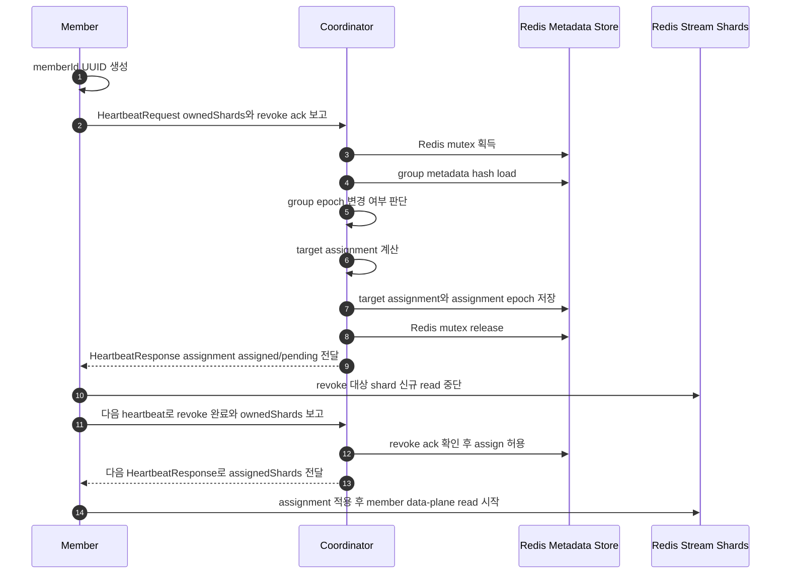
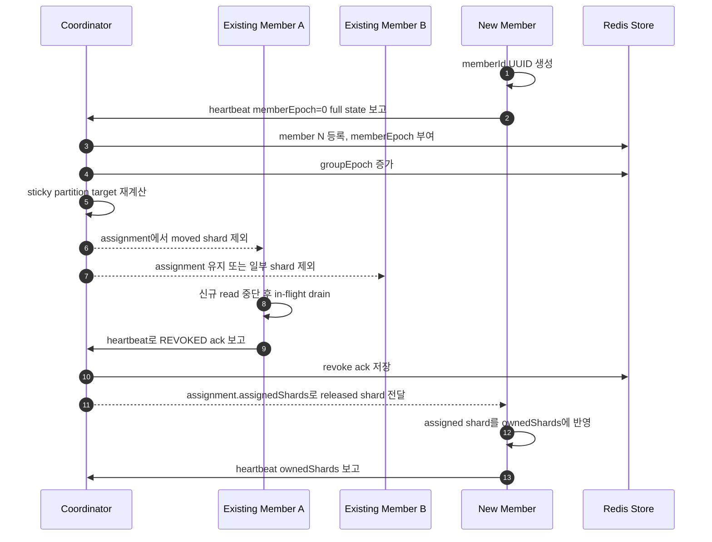
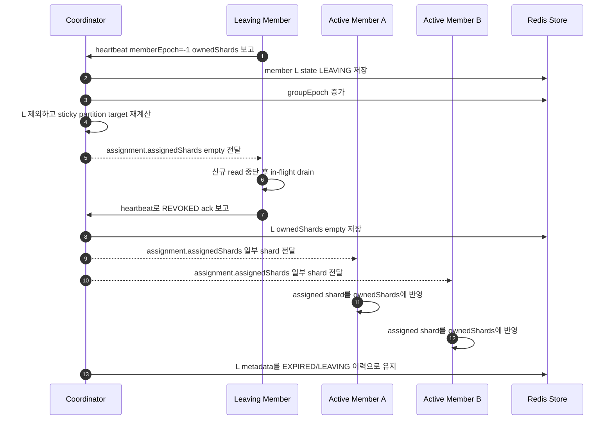
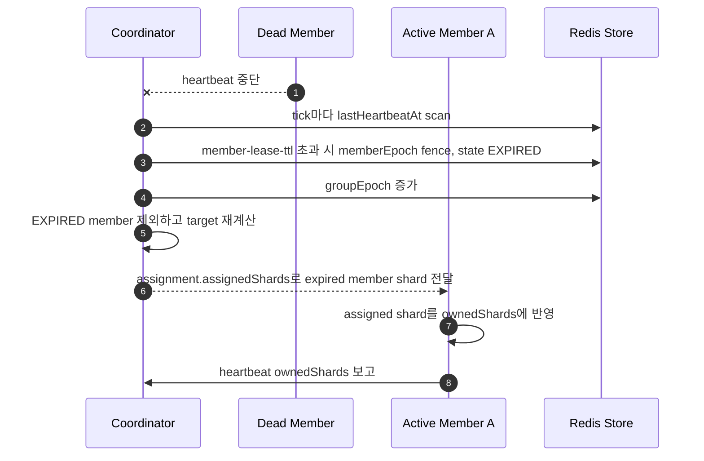

# Coordinator Architecture

## Architecture Summary



## Components

### Coordinator Worker

* Coordinator API로 들어온 `{streamPrefix, consumerGroup}`을 group identifier로 사용한다.
* group metadata 변경을 event loop에서 처리한다.
* member heartbeat와 `member-lease-ttl`을 보고 join/leave/fence를 판단한다.
* target assignment를 계산하고 Redis metadata hash에 저장한다.
* member current assignment를 보고 revoke 완료 여부를 확인한다.
* revoke 완료 전 해당 shard를 새 member에게 assign하지 않는다.

### Coordinator API

* create, scale, consumer concurrency update, rollback, heartbeat request를 직접 받는다.
* API path의 `{streamPrefix, consumerGroup}`으로 대상 group을 결정한다.
* member나 producer local YAML에서 stream/group/shard count desired state를 수집하지 않는다.

### Coordinator Store

* Redis에 group metadata, member metadata, target assignment, current assignment를 저장한다.
* `{streamPrefix, consumerGroup}` metadata hash의 `aggregate` field가 canonical source of truth이다.
* Redis mutex와 `storeRevision` compare-and-set으로 stale writer를 막는다.

### Member Runtime

* runtime 시작 시 `memberId` UUID를 만든다.
* coordinator heartbeat API로 현재 owned shard, revocation progress, revoke ack를 보고한다.
* 같은 heartbeat response에서 member epoch, assigned/pending shard, fencing status를 받는다.
* revoke 대상 shard는 신규 read를 멈추고 in-flight를 비운다.
* assign 대상 shard는 member data-plane이 적용한다.

### Member Data-Plane Boundary

* coordinator는 Redis Stream message를 읽거나 ack하지 않는다.
* coordinator는 handler, retry, pending recovery, idempotency marker를 설정하지 않는다.
* member data-plane은 coordinator가 내려준 assignment/member epoch을 기준으로 read 여부를 판단한다.

## Loop Timing

Concrete config 값은 `prd/06-data-config-observability.md`에만 둔다. 이 문서에서는 loop가 어떤 신호로 실행되는지만 정의한다.

## Coordinator Event Loop

Coordinator는 주기와 이벤트를 함께 사용한다.

```text
coordinator event loop
  every coordinator.tick-interval
  or when heartbeat or metadata event is observed

steps:
  1. group metadata load
  2. member heartbeat scan
  3. mark members EXPIRED when now - lastHeartbeatAt > member-lease-ttl
  4. group epoch bump if membership or metadata changed
  5. target assignment recompute if group epoch changed
  6. revoke/assign dependency resolution
  7. metrics publish
```

Event loop와 state 접근 API는 같은 Redis mutex와 `storeRevision` CAS boundary를 사용한다. 같은 Redis metadata store를 바라보는 coordinator pod가 여러 개 있어도 같은 group은 mutex와 revision check로 직렬화된다. 먼저 update한 pod가 저장하고, 늦은 pod는 reload 후 retry하거나 conflict를 반환한다.

## Heartbeat Reconciliation Plane

Member와 coordinator 사이의 제어면은 heartbeat 하나로 통일한다. KIP-848의 `ConsumerGroupHeartbeat`처럼 heartbeat는 단순 liveness ping이 아니라 join/leave, owned shard 보고, revoke ack, assignment 전달을 모두 처리하는 reconciliation RPC이다.

```http
POST /coord/v1/streams/{streamPrefix}/groups/{consumerGroup}/members/{memberId}/heartbeat
```

KIP-848 mapping:

* `GroupId`: HTTP path의 `{streamPrefix, consumerGroup}`이다.
* `MemberId`: HTTP path의 `{memberId}`이며 member runtime이 생성한 UUID이다.
* `MemberEpoch=0`: join 또는 rejoin heartbeat이다. member는 full state를 보내야 한다.
* `MemberEpoch=-1`: leave heartbeat이다. member는 더 이상 shard를 소유하지 않겠다는 의사를 보낸다.
* `TopicPartitions`: Redis Stream에서는 `ownedShards`이다. member가 지금 사용할 수 있다고 보고하는 shard set이다.
* `Assignment.AssignedTopicPartitions`: Redis Stream에서는 `assignment.assignedShards`이다. 즉시 read 가능한 shard set이다.
* `Assignment.PendingTopicPartitions`: Redis Stream에서는 `assignment.pendingShards`이다. target에는 포함되지만 이전 owner revoke가 끝나지 않아 아직 read하면 안 되는 shard set이다.

* assignment는 별도 polling loop로 가져오지 않는다. 다음 heartbeat 응답이 최신 assignment이다.
* coordinator API가 일시적으로 응답하지 못하면 member는 현재 assignment를 유지하고 다음 heartbeat에 재시도한다.
* member가 보고한 runtime consumer capacity는 관측값이고, 실제 consumer worker 수 상한은 coordinator metadata의 server-side consumer concurrency policy가 결정한다.
* 첫 heartbeat, `memberEpoch=0` rejoin, error response 이후, request timeout 이후에는 full state를 보낸다. 정상 heartbeat에서는 변하지 않은 optional field를 생략할 수 있지만, MVP server는 full state request를 항상 받아야 한다.

Heartbeat request 예시:

```json
{
  "protocolVersion": 1,
  "requestId": "hb-member-a-000042",
  "memberId": "member-a",
  "memberEpoch": 11,
  "metadataVersion": 8,
  "runtimeConsumerCapacity": {
    "runtimeMaxConcurrency": 12,
    "availableConcurrency": 8
  },
  "ownedShards": [
    {
      "shardIndex": 0,
      "state": "OWNED"
    }
  ],
  "revokingShards": [
    {
      "shardIndex": 3,
      "state": "DRAINING",
      "inFlight": 2,
      "ackedAt": null
    }
  ]
}
```

Heartbeat response 예시:

```json
{
  "responseTo": "hb-member-a-000042",
  "status": "OK",
  "memberId": "member-a",
  "memberEpoch": 12,
  "heartbeatIntervalMs": 3000,
  "rebalanceTimeoutMs": 60000,
  "groupEpoch": 12,
  "assignmentEpoch": 12,
  "metadataVersion": 9,
  "assignedMaxConcurrency": 12,
  "assignment": {
    "error": "NONE",
    "assignedShards": [
      {"shardIndex": 0}
    ],
    "pendingShards": [
      {"shardIndex": 2}
    ],
    "metadataVersion": 9
  }
}
```

### Heartbeat Request Fields

| Field | Required | Role |
| --- | --- | --- |
| `protocolVersion` | yes | Coordinator-module coordination version. incompatible version은 `UNSUPPORTED_PROTOCOL`로 거절한다. |
| `requestId` | yes | 중복 응답과 로그 추적용 id. |
| `memberId` | yes | path의 `{memberId}`와 같아야 한다. member runtime 시작 시 생성한 UUID이며 이 runtime incarnation을 식별한다. coordinator는 이 id에 member epoch을 부여하고 fencing한다. |
| `memberEpoch` | yes | `0`이면 신규 join 또는 coordinator가 이미 `EXPIRED`/`FENCED`로 판단한 member의 rejoin, `-1`이면 leave, 양수이면 coordinator가 직전 response로 발급한 epoch이다. stale 값이면 `FENCED_MEMBER_EPOCH`, coordinator가 발급하지 않은 값이면 `INVALID_REQUEST` 대상이다. |
| `metadataVersion` | yes | member가 캐시한 group metadata version. 낮으면 response의 assignment metadata version 기준으로 갱신한다. |
| `runtimeConsumerCapacity` | yes | member runtime이 보고하는 처리 가능 상태. `runtimeMaxConcurrency`는 process local consumer worker limit이고, coordinator의 server-side `maxConcurrency`를 올릴 수 없다. |
| `ownedShards` | yes | KIP-848의 `TopicPartitions`에 해당한다. member가 지금 read 가능하다고 보고하는 shard 목록이다. |
| `revokingShards` | no | Redis-specific drain progress이다. `REVOKED` 상태와 `inFlight=0`이면 revoke ack로 처리한다. |
| `shardProgress` | no | consumer가 coordinator metrics용으로 보고하는 Redis Stream progress이다. coordinator가 허용한 owned/revoking shard만 저장하며, 임의 shard progress는 fencing 대상이다. |

### Heartbeat Response Fields

| Field | Required | Role |
| --- | --- | --- |
| `responseTo` | yes | 어떤 heartbeat request에 대한 응답인지 표시한다. |
| `status` | yes | heartbeat 처리 결과. `OK`가 아니면 member는 assignment 적용 전 status별 처리를 먼저 한다. |
| `memberId` | yes | path의 member id를 echo한다. |
| `memberEpoch` | yes | member가 다음 heartbeat부터 사용해야 하는 epoch. |
| `heartbeatIntervalMs` | yes | member가 다음 정상 heartbeat를 보내야 하는 server-side 권장 주기이다. |
| `rebalanceTimeoutMs` | yes | coordinator-owned revoke/drain deadline이다. 이 시간 안에 revoke 완료 보고가 없으면 coordinator는 member를 fence하고 shard를 재할당할 수 있다. |
| `groupEpoch` | yes | coordinator가 본 최신 group metadata epoch. |
| `assignmentEpoch` | yes | target assignment가 계산된 epoch. |
| `metadataVersion` | yes | 최신 metadata version. member cache가 낮으면 metadata를 갱신한다. |
| `assignedMaxConcurrency` | yes | coordinator metadata가 이 member에게 허용한 consumer worker 수. partition/shard 개수가 아니며, member는 이 값보다 많은 consumer worker를 열 수 없다. |
| `assignment` | no | member가 수렴해야 할 assignment이다. 변경이 없고 이미 수렴했다면 `null`일 수 있다. |
| `assignment.assignedShards` | when assignment present | 즉시 read 가능한 shard 목록이다. |
| `assignment.pendingShards` | when assignment present | target에는 있지만 이전 owner가 아직 release하지 않아 read하면 안 되는 shard 목록이다. |
| `assignment.metadataVersion` | when assignment present | assignment와 함께 적용할 metadata version이다. |

### Heartbeat Reconciliation Rules

KIP-848처럼 member는 response의 assignment와 자신의 local owned shard를 비교해서 수렴한다.

* response `memberEpoch`을 local member epoch으로 갱신한다.
* member는 `memberEpoch`을 직접 증가시키거나 `0`으로 reset하면 안 된다. coordinator가 response로 발급한 epoch만 다음 heartbeat에 사용한다.
* active member의 `memberEpoch=0` reset, 현재 epoch보다 큰 positive epoch, `-1` 외의 negative epoch은 `INVALID_REQUEST`로 거절한다.
* 현재 epoch보다 낮은 positive epoch은 stale heartbeat로 보고 `FENCED_MEMBER_EPOCH`로 거절한다.
* local `ownedShards`에는 있지만 `assignment.assignedShards`에 없는 shard는 revoke 대상이다. member는 해당 shard의 신규 read를 중단하고 local in-flight가 0이 되면 다음 heartbeat에 `revokingShards.state=REVOKED`로 보고한다.
* `OK` response의 `assignment.assignedShards`에는 있지만 local `ownedShards`에 없는 shard는 새로 read 가능한 shard이다.
* `SYNC_METADATA`와 `REVOKE_PENDING` response에서는 `assignment.assignedShards`에 신규 shard가 있어도 read를 시작하지 않는다. 이미 읽고 있던 shard 중 `assignedShards`에 남은 shard만 유지한다.
* `assignment.pendingShards`는 target assignment에는 포함되지만 아직 이전 owner가 release하지 않은 shard이다. member는 pending shard를 read하면 안 된다.
* 한 response에서 revoke와 신규 assign을 동시에 강제하지 않는다. pending shard는 이전 owner의 release가 확인된 뒤 다음 heartbeat에서 `assignedShards`로 이동한다.
* revoke가 발생한 member는 다음 heartbeat interval을 기다리지 않고 즉시 heartbeat를 보내 revoke ack를 보고한다.
* coordinator는 `assignment`을 member가 해당 `assignmentEpoch`으로 수렴했다고 보고할 때까지 heartbeat response에 반복해서 내려보낼 수 있다.
* `rebalanceTimeoutMs` 안에 revoke ack가 오지 않으면 coordinator는 해당 member를 group에서 제거하고 `FENCED_MEMBER_EPOCH`로 fence한 뒤 target assignment를 다시 계산한다.
* `UNKNOWN_MEMBER_ID` 또는 `FENCED_MEMBER_EPOCH`를 받으면 member는 모든 shard read/ack를 중단하고 같은 `memberId`, `memberEpoch=0`, full state heartbeat로 rejoin한다.
* request timeout이나 `RETRY` 이후 다음 heartbeat는 full state를 포함해야 한다.

### Heartbeat Enums

`MemberLifecycleState`는 coordinator 내부 상태이다. heartbeat request의 source of truth는 `memberEpoch`이다.

| Value | Role |
| --- | --- |
| `STARTING` | `memberEpoch=0` join을 처리 중인 상태. |
| `ACTIVE` | heartbeat가 정상이고 assigned shard를 처리 중인 상태. |
| `DRAINING` | graceful shutdown 또는 revoke 처리 중이라 신규 assign을 받지 않는 상태. |
| `LEAVING` | `memberEpoch=-1` leave를 받은 상태. coordinator는 소유 shard를 revoke 대상으로 만든다. |
| `EXPIRED` | `member-lease-ttl` 동안 heartbeat가 없어 coordinator가 제거 대상으로 판단한 상태. |
| `FENCED` | coordinator가 이 member epoch을 더 이상 유효하지 않게 만든 상태. member는 read/ack를 중단해야 한다. |

`ShardAssignmentState`:

| Value | Role |
| --- | --- |
| `OWNED` | member가 현재 소유하고 신규 read 가능한 shard. |
| `REVOKING` | coordinator assignment에서 제외되어 member가 신규 read를 중단해야 하는 shard. |
| `DRAINING` | 신규 read는 중단했고 local in-flight 처리를 비우는 중인 shard. |
| `REVOKED` | local in-flight가 0이고 member가 더 이상 소유하지 않는 shard. 다음 heartbeat에서 ack로 보고한다. |

`HeartbeatStatus`:

| Value | Role |
| --- | --- |
| `OK` | request가 반영됐고 assignment를 적용할 수 있다. |
| `RETRY` | coordinator가 일시적으로 처리하지 못했다. member는 현재 assignment만 처리하고 다음 heartbeat에 full state로 재시도한다. |
| `SYNC_METADATA` | member local metadata view가 coordinator보다 높거나 다르다. response metadata version으로 낮추고 초과 ownership만 revoke/drain한다. 신규 shard read는 시작하지 않는다. |
| `REVOKE_PENDING` | metadata version은 맞았지만 revoke-before-assign handoff가 아직 끝나지 않았다. drain을 계속하고 신규 shard read는 시작하지 않는다. |
| `UNKNOWN_MEMBER_ID` | coordinator가 member를 모른다. member는 같은 `memberId`, `memberEpoch=0`, full state heartbeat로 rejoin한다. |
| `FENCED_MEMBER_EPOCH` | member epoch이 coordinator state와 맞지 않는다. member는 모든 read/ack를 중단하고 rejoin한다. |
| `UNSUPPORTED_PROTOCOL` | coordinator-module coordination version이 호환되지 않는다. |
| `INVALID_REQUEST` | 필수 필드 누락, 잘못된 epoch, path/body 불일치 등 request validation 실패이다. |
| `GROUP_AUTHORIZATION_FAILED` | group 접근 권한이 없다. |

## Member Scale-Out Sequence

새 member가 추가되면 coordinator는 sticky partition 기준으로 필요한 shard만 이동시킨다. 기존 owner가 revoke ack를 보내기 전까지 새 member는 해당 shard를 assign받지 않는다.



## Member Scale-In Sequence

정상 scale-in은 member가 `memberEpoch=-1` heartbeat를 보내는 graceful leave로 처리한다. coordinator는 leaving member에게 신규 assign을 주지 않고, 소유 shard를 revoke 대상으로 만든다.



## Idle Member Removal

비정상 종료나 네트워크 단절처럼 member가 `LEAVING`을 보낼 수 없는 경우 coordinator가 tick마다 heartbeat 만료를 확인해 제거한다.

판정 기준:

* `now - lastHeartbeatAt > member-lease-ttl`: member를 `EXPIRED`로 전환하고 member epoch을 fencing한다.
* `EXPIRED` member의 shard는 revoke ack를 기다릴 수 없으므로 member epoch fencing 후 새 owner에게 assign한다.
* `EXPIRED` member metadata는 삭제하지 않고 group 이력으로 유지한다.



Revoke/assign 규칙:

* assignment에서 빠진 shard를 가진 member는 해당 shard의 신규 read를 즉시 중단한다.
* 이미 data-plane에 전달한 message는 완료 후 revoke ack로 보고한다.
* in-flight가 0이 되면 `revokingShards.state=REVOKED`를 다음 heartbeat에 포함한다.
* coordinator는 revoke ack 또는 member fencing을 확인하기 전 새 owner의 `assignment.assignedShards`에 해당 shard를 넣지 않는다.
* `assignment.assignedShards`를 받은 member는 해당 shard를 local `ownedShards`에 반영한다.
* revoking member의 heartbeat가 `member-lease-ttl` 동안 끊기거나 `rebalanceTimeoutMs`를 초과하면 coordinator는 member를 fencing하고 해당 shard를 재할당한다.
