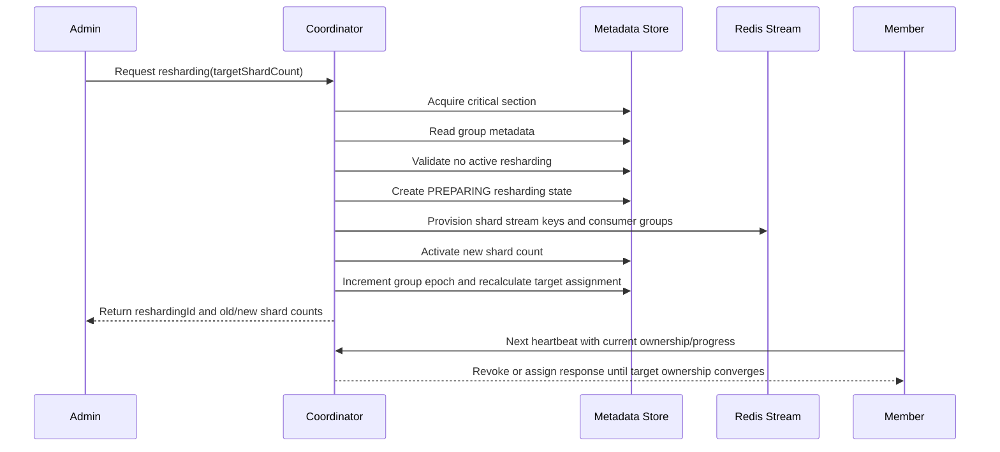

# 리샤딩, 라우팅, Admin API

## Stream Key 모델

Coordinator는 stream name version token을 붙이거나 관리하지 않는다. `streamPrefix`는 사용자가 정하는 Redis Stream namespace다. 애플리케이션이 versioned name을 원하면 `orders-blue`, `orders.blue`처럼 `streamPrefix` 안에 직접 포함해야 한다.

Coordinator는 shard index만 붙인다.

```text
streamKey = "{streamPrefix}:{shardIndex}"
```

예시:

| 사용자 `streamPrefix` | Shard count | Coordinator가 생성하는 stream key |
| --- | --- | --- |
| `orders` | `3` | `orders:0`, `orders:1`, `orders:2` |
| `orders-blue` | `2` | `orders-blue:0`, `orders-blue:1` |

`streamPrefix`에는 Redis Cluster hash tag brace를 포함할 수 없다. Shard key는 hash tag를 쓰지 않아 Redis Cluster가 hash slot 기준으로 분산할 수 있게 한다.

## Producer Routing

Producer는 로컬 shard count를 source of truth로 쓰지 않는다. Producer는 coordinator에서 routing metadata를 가져온다.

```json
{
  "streamPrefix": "orders",
  "consumerGroup": "orders-consumer",
  "metadataVersion": 12,
  "shardCount": 8,
  "streamKeyPattern": "orders:{shardIndex}"
}
```

Producer는 이 metadata를 캐시하고 partition key를 `[0, shardCount)` 범위의 shard index로 라우팅한다. `metadataVersion`이 바뀌거나, cache TTL이 만료되거나, publish 중 stale routing을 감지하면 cache를 갱신한다.

Routing은 동일 metadata snapshot 안에서만 deterministic하다.

* 같은 routing protocol
* 같은 `shardCount`
* 같은 partition key

Shard count가 바뀌면 동일 partition key도 다른 Redis Stream shard로 들어갈 수 있다. Coordinator는 모든 shard에 걸친 동일 event id의 global deduplication을 제공하지 않는다.

## Duplicate Publish Boundary

중요 시나리오:

1. Producer A가 `eventId=E`, `partitionKey=order-123`을 old routing metadata로 shard `2`에 publish한다.
2. Producer가 성공 응답을 보기 전에 Redis response가 유실된다.
3. 운영자가 group을 `4` shards에서 `8` shards로 scale한다.
4. Producer A가 routing metadata를 갱신한 뒤 retry한다.
5. 같은 partition key가 shard `6`으로 라우팅될 수 있다.
6. 같은 event ID가 두 shard 위치에 존재할 수 있다.

운영 제약:

* Duplicate-sensitive workload는 shard scale-out/in 중 produce하면 안 된다.
* Scale 전에 producer를 중지한다.
* In-flight XADD와 retry window를 drain한다.
* Scale을 실행한다.
* Producer routing metadata를 갱신한다.
* Publishing을 재개한다.

Producer traffic을 멈출 수 없다면 workload는 at-least-once로 취급하고 application idempotency로 보호해야 한다.

## Resharding Flow

Shard count 변경은 Coordinator Admin API로만 수행한다.



## Member Startup Boundary

Member startup은 다음으로 제한된다.

* heartbeat를 통해 coordinator metadata 확인
* member ID 생성 또는 로드
* `{streamPrefix, consumerGroup}`로 heartbeat 시작
* heartbeat response의 assignment 적용
* capacity와 progress 보고

Member startup은 다음을 하지 않는다.

* local YAML shard count를 desired state로 제출
* group metadata 생성 또는 변경
* consumer deployment 또는 listener concurrency 변경

## Admin API Source of Truth

초기 group 생성과 shard scale-out/in은 Coordinator Admin API로만 수행한다.

Source of truth:

* shard count: coordinator group metadata
* consumer `concurrency`: `@StreamListener(concurrency = N)`이 만드는 consumer-side logical member 수
* routing metadata: coordinator producer routing endpoint

## Create Group

`initialShardCount`는 생략할 수 있다. 생략하면 coordinator default를 사용한다.

처리 순서:

1. group이 이미 존재하지 않는지 확인한다.
2. 요청 shard count를 검증한다.
3. provisioning이 켜져 있으면 shard stream key와 Redis consumer group을 생성한다.
4. `shardCount`와 `groupEpoch=1`을 저장한다.
5. duplicate create request는 `409 Conflict`로 거절한다.

## Scale Out / Scale In

`scale-out`과 `scale-in`은 같은 `targetShardCount` request로 표현한다.

Coordinator는 다음 조건에서만 요청을 수락한다.

* group에 active resharding이 없다.
* `targetShardCount`가 현재 shard count와 다르다.
* `targetShardCount`가 양수다.

Consumer parallelism은 scale metadata가 아니다. 운영자는 consumer deployment 또는 listener configuration을 바꿔 병렬성을 조정한다. coordinator는 heartbeat로 들어온 logical member들을 관찰하고 live member count 기준으로 재배치한다.

## Monitoring

Group monitoring은 다음을 반환한다.

* group epoch
* assignment epoch
* shard count
* consumer logical member 수와 runtime capacity
* active resharding
* target/current assignment summary
* member liveness
* revoke progress
* consumer progress

Resharding monitoring은 다음을 반환한다.

* `reshardingId`
* old/new shard counts
* provisioning state
* member-reported drain progress
* revoke progress
* rollback eligibility

## Rollback

Rollback은 metadata로 안전하게 되돌릴 수 있는 resharding state에서만 허용한다. 새로 추가된 shard index에 이미 message가 쓰였다면 operator-defined policy로 drain, replay, 보정해야 한다. Rollback은 Redis Stream data와 coordinator metadata를 하나의 global transaction으로 묶지 않는다.
