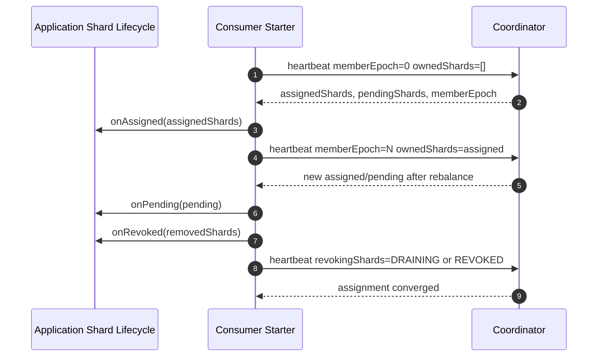

# RedisStream Spring Boot Starter and Integration Contract

## Goal

The coordinator server is only the control plane. Applications still need a runtime integration layer that joins a coordinator group, sends heartbeats, receives shard assignments, starts or stops local shard workers, and reports revoke/drain progress.

This project provides that integration as a Spring Boot starter:

```text
com.redisstream:redisstream-spring-boot-starter
```

Public Kotlin APIs live under `com.redisstream.consumer` and `com.redisstream.producer`.

The starter must be usable by any application without forcing a specific Redis Stream processing framework. Applications can either implement shard lifecycle callbacks directly, or opt into the built-in Redis Stream polling adapter. Application code still owns business handler execution, retries, DLQ, idempotency, and transaction boundaries. The starter provides at-least-once processing semantics by default and does not claim a single-processing guarantee.

## Public Contract

Application code implements one interface:

```kotlin
interface CoordinatorShardLifecycle {
    fun onAssigned(shards: Set<CoordinatorShard>, context: CoordinatorConsumerContext)

    fun onRevoked(shards: Set<CoordinatorShard>, context: CoordinatorConsumerContext): Set<CoordinatorShard>

    fun onPending(shards: Set<CoordinatorShard>, context: CoordinatorConsumerContext) {
    }

    fun onFenced(context: CoordinatorConsumerContext) {
    }
}
```

Applications with custom worker pools may also implement `CoordinatorRuntimeCapacityProvider` on the same lifecycle bean:

```kotlin
interface CoordinatorRuntimeCapacityProvider {
    fun runtimeCapacity(context: CoordinatorConsumerContext): RuntimeConsumerCapacity
}
```

If provided, the managed consumer reports this runtime capacity in heartbeat requests. If not provided, it reports `runtime-max-concurrency` as fully available. The built-in Redis Stream polling lifecycle implements this provider and subtracts current in-flight handler calls from available capacity.

The built-in Redis Stream polling lifecycle also reports shard consumption progress to the coordinator heartbeat. This is protocol data, not the public metrics surface. The coordinator validates the reported shard against assigned or revoking shards and exposes group-level consumption progress through its monitoring API and Micrometer metrics.

Rules:

* `onAssigned` starts or resumes local workers for assigned shards.
* `onPending` exposes shards that are targeted for this member but blocked by revoke-before-assign.
* `onRevoked` stops new reads for revoked shards, drains local in-flight work, and returns the shards that are fully revoked.
* If `onRevoked` returns only part of the requested set, the starter keeps reporting the remaining shards as `DRAINING` and calls `onRevoked` again on later heartbeat cycles.
* `onFenced` stops all local workers and allows the starter to rejoin with `memberEpoch=0`.
* When `graceful-leave-on-stop=true`, the managed consumer sends a final `memberEpoch=-1` heartbeat during shutdown and reports revoked or draining shards.

## Starter Responsibilities

The starter owns:

* stable `memberId` and `memberName` configuration
* heartbeat scheduling
* coordinator HTTP calls
* `memberEpoch` and `metadataVersion` tracking
* `ownedShards` reporting
* `revokingShards` reporting
* assignment diffing
* listener callbacks for assign, pending, revoke, and fenced states
* optional runtime capacity reporting through `CoordinatorRuntimeCapacityProvider`
* optional shard progress reporting through `CoordinatorShardProgressProvider`

In direct lifecycle mode, the starter does not own:

* Redis Stream polling
* payload deserialization
* user handler execution
* `XACK`
* retry and DLQ
* idempotency markers
* business transaction boundaries

In built-in Redis polling mode, the starter owns:

* shard-key derivation from coordinator assignments
* `XREADGROUP`
* handler invocation through `RedisStreamMessageHandler`
* successful-message `XACK`
* last delivered and last acked Redis Stream id tracking for coordinator progress reporting
* stopping shard pollers during revoke/fencing

The built-in polling mode still does not own retries, DLQ, idempotency, or business transaction boundaries.

## Processing Guarantee

The starter provides at-least-once processing semantics.

Duplicate attempts can happen when:

* Redis returns a message and the process crashes before `XACK`
* pending entries are reclaimed by another consumer
* producer retries after an uncertain `XADD` result
* shard scale-out/in changes routing metadata while publish attempts are still in flight
* a handler succeeds in one external system and fails before all other side effects are complete

The starter must not claim a single-processing guarantee. Application handlers can involve multiple business side effects that cannot be atomically committed with Redis Stream ACKs. Applications that cannot tolerate duplicate effects must implement their own domain-level idempotency, deduplication, unique constraints, or compensation logic.

## Metrics

Coordinator metrics are the public operational surface for open-source users. The starter does not auto-register consumer or producer Micrometer meters and does not expose `redis-stream-coordinator.consumer.metrics` or `redis-stream-coordinator.producer.metrics` settings. Consumer progress is sent to the coordinator heartbeat and published from the coordinator only.

## Spring Boot Configuration

```yaml
redis-stream-coordinator:
  consumer:
    enabled: true
    coordinator-base-url: http://localhost:8080
    stream-prefix: orders
    consumer-group: orders-consumer
    member-id: ${HOSTNAME:${random.uuid}}
    member-name: orders-worker
    runtime-max-concurrency: 4
    heartbeat-interval: 3s
    rebalance-timeout: 60s
    graceful-leave-on-stop: true
    username: member
    password: member-password
```

If a `CoordinatorShardLifecycle` bean exists, auto-configuration creates a `CoordinatorManagedConsumer` bean. Applications can override `CoordinatorClient` or `CoordinatorManagedConsumer` with their own beans.

Alternatively, applications can enable the built-in Redis Stream consumer adapter by providing a `RedisStreamMessageHandler` bean and enabling `redis-stream-coordinator.consumer.redis.enabled`.

```yaml
redis-stream-coordinator:
  consumer:
    enabled: true
    coordinator-base-url: http://localhost:8080
    stream-prefix: orders
    consumer-group: orders-consumer
    member-name: orders-worker
    redis:
      enabled: true
      poll-batch-size: 10
      poll-timeout: 1s
      ack:
        # AUTO uses XACKDEL when the connected Redis server supports it, otherwise XACK.
        mode: AUTO
        xackdel-reference-policy: ACKED
      failure:
        # XNACK is available on Redis 8.8+. The default keeps failed records pending.
        mode: LEAVE_PENDING
        xnack-mode: FAIL
```

## Runtime Flow



## Producer Routing Client

The RedisStream starter includes a `CoordinatorClient.producerRouting` method so applications can share the same coordinator HTTP client for producer routing metadata. Producer-side local caches must invalidate when `metadataVersion` changes.

The starter also provides a `ProducerRoutingCache` component under `com.redisstream.producer`. It fetches `/producer-routing`, caches the response for `redis-stream-coordinator.producer.routing-refresh-interval`, and replaces the cached metadata when a refreshed response has a newer `metadataVersion`.

```yaml
redis-stream-coordinator:
  producer:
    enabled: true
    coordinator-base-url: http://localhost:8080
    stream-prefix: orders
    consumer-group: orders-consumer
    routing-refresh-interval: 30s
    # Default 1 avoids extra duplicate attempts after uncertain XADD failures.
    publish-max-attempts: 1
    xadd:
      max-len: 10000000
      approximate-trimming: true
```

Application producers can call `ProducerRoutingCache.route(partitionKey)` and write to the returned `streamKey`, or inject `RedisStreamPublisher` to route and `XADD` in one call. The built-in hasher uses the v1 routing contract; applications do not configure a per-group hash algorithm or seed.

The v1 routing contract uses 32-bit Murmur3 with deterministic rejection sampling instead of a direct `% shardCount` mapping. This removes modulo bias while keeping routing deterministic for the same partition key and shard count. Future incompatible routing changes must use a new producer-routing protocol/API version.

`RedisStreamPublisher` supports single-message field maps, a convenience payload method that writes the `payload` field, and ordered best-effort batch publishing through `publishAll`. It writes with `XADD MAXLEN` by default using a large approximate cap so sample and development streams do not grow without bound; applications can override the global `xadd.max-len` value or pass per-message `RedisStreamPublishOptions`. A failed write invalidates the routing cache so the next publish refreshes metadata. `publish-max-attempts` can opt into same-call retry after refreshing metadata, but the default is `1` because retrying after an uncertain Redis write can duplicate messages.

The producer path does not provide global event id deduplication. It does not prevent the same event id from being published to a different shard or stream version after shard scale-out/in changes routing metadata.

Operational constraint:

* Do not execute shard scale-out/in while producers have in-flight publish calls or retry windows if the workload is sensitive to duplicate messages.
* Pause producers, let in-flight XADD and retries drain, call the scale API, refresh producer routing metadata, then resume producing.
* If producers must remain online during scale, treat producer delivery as at-least-once and rely on application-level deduplication or compensation to suppress duplicate side effects.

The built-in consumer checks the connected Redis server version before sending newer stream commands. `ack.mode=AUTO` resolves to `XACKDEL` on Redis 8.2+ and `XACK` on older Redis. Explicit `ack.mode=XACKDEL` fails before sending the ack command if the server is too old. Failed-message `failure.mode=XNACK` is guarded by Redis 8.8+ support; the default `LEAVE_PENDING` preserves classic Redis Stream retry behavior.

Redis commands issued by the built-in producer and consumer adapters go through a shared `RedisStreamCommandsTemplate`. The template owns `XREADGROUP`, `XACK`, `XACKDEL`, `XNACK`, `XADD`, and server-version lookup so command shapes stay centralized and testable.

## MVP Acceptance Criteria

* A Spring Boot application can add the starter and implement `CoordinatorShardLifecycle`.
* The starter sends join heartbeats with `memberEpoch=0`.
* The starter tracks `memberEpoch` and `metadataVersion` from coordinator responses.
* The starter notifies newly assigned shards.
* The starter notifies revoked shards and reports revoke completion to the coordinator.
* The starter retries incomplete revoke callbacks across heartbeat cycles for long drain windows.
* The starter can report runtime capacity from a lifecycle provider or from the built-in Redis polling adapter.
* The starter resets local assignment state on fencing and rejoins.
* The starter can send a graceful leave heartbeat on shutdown.
* The starter exposes an overridable `CoordinatorClient`.
* The starter provides a producer routing cache that refreshes and replaces metadata by `metadataVersion`.
* The starter rejects producer routing metadata that belongs to a different stream/group or omits active shard indexes.
* The starter provides a Redis Stream publisher that routes by partition key and appends to the active shard.
* The starter provides convenience payload and ordered batch publish APIs.
* The publisher invalidates stale routing after write failures and supports opt-in bounded retry.
* The starter provides an opt-in Redis Stream consumer adapter that polls assigned shards and acknowledges successfully handled records.
* The starter reports built-in polling progress to coordinator heartbeat.
* The starter documents at-least-once delivery and duplicate risks around producer retry, pending recovery, and shard scaling.

## Future Work

* Backoff and circuit-breaker policy for coordinator unavailability.
