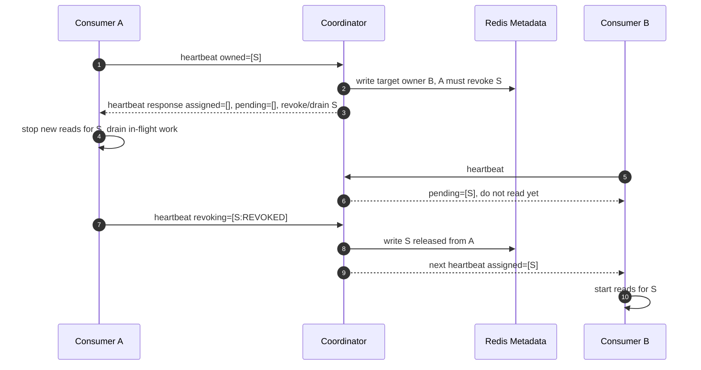

# Failure Handling and Edge Case Design

이 문서는 개별 장애 목록만 나열하지 않고, Redis Stream Coordinator가 실패 상황을 어떤 원칙으로 처리해야 하는지 정의한다. 핵심 원칙은 모든 coordinator workflow가 Redis group metadata key와 client retry만으로 lease 범위 안에서 복구 가능해야 한다는 점이다.

Coordinator는 Redis Stream message processing을 소유하지 않는다. Coordinator가 소유하는 것은 group metadata, member epoch, target assignment, current assignment report, resharding metadata, producer routing metadata이다.

## Design Goals

* 짧은 coordinator 장애가 healthy consumer/producer를 즉시 멈추면 안 된다.
* 긴 coordinator 장애는 split ownership이나 무기한 stale producer routing이 생기기 전에 fail closed해야 한다.
* 새 coordinator pod는 old pod의 memory가 아니라 Redis에 기록된 metadata에서 이어서 시작해야 한다.
* Heartbeat response는 잃어버리면 끝나는 일회성 command가 아니라 commit된 최신 assignment state의 반복 가능한 view여야 한다.
* Redis metadata는 최근 write loss가 가능하다. Consumer가 Redis 현재 version보다 높은 metadata version을 보고하면 coordinator는 현재 Redis version으로 metadata sync round를 시작해야 한다.
* 지원하지 않는 Redis command는 fail fast하거나 문서화된 fallback만 사용한다.

## Core Model

### Redis-Recorded State Machine

모든 coordinator workflow는 Redis-recorded state machine이다. Response는 현재 group metadata key에서만 파생한다.

```text
request or tick
  -> acquire Redis mutex
  -> load group metadata hash
  -> validate input
  -> compute next state
  -> write metadata with storeRevision CAS
  -> return response derived from the written metadata
```

Coordinator는 client에게 행동을 요구하는 응답을 보내기 전에 해당 행동의 근거가 되는 next state를 먼저 Redis metadata에 기록해야 한다. 기록 전에 coordinator가 죽으면 client retry는 이전 state를 본다. 기록 후 response가 client에게 도달하기 전에 coordinator가 죽으면 Redis가 해당 version을 유지하는 동안 다음 heartbeat 또는 routing refresh가 같은 recorded decision을 다시 반환한다.

### Metadata Version Correction

Client에게 반환된 metadata version은 이후 Redis에서 사라질 수 있다. 예를 들어 coordinator가 metadata version `10`을 Redis에 쓰고 heartbeat response로 반환했는데, 직후 Redis failover 또는 restore로 version `9` 상태로 돌아갈 수 있다. 이 경우 client는 Redis가 현재 저장한 값보다 더 최신 state를 이미 관측한 것이다.

Redis를 source of truth로 유지한다. 더 높은 client version은 Redis state를 복구할 권한이 아니라, client가 stale local view를 들고 있을 수 있다는 신호로 취급한다.

* Coordinator response는 현재 `metadataVersion`, `assignmentEpoch`, 관련 member epoch를 포함한다.
* Consumer와 producer는 현재 process lifetime 동안 관측한 최고 version을 기억한다. 더 강한 rollback detection이 필요한 deployment는 module SPI를 통해 작은 local 또는 external persistent version store를 제공해야 한다.
* 모든 heartbeat와 routing refresh는 client가 관측한 최고 version을 포함한다.
* Coordinator가 `clientMaxObservedVersion > storedMetadataVersion`을 보면 metadata regression으로 보고 metadata correction round를 시작한다. 단, coordinator가 metadata schema나 coordination version을 해석할 수 없으면 fail closed한다.
* Coordinator는 rollback된 Redis version을 단순히 증가시켜 문제를 "복구"하면 안 된다. 유실된 state transition의 내용이 무엇인지 알 수 없기 때문이다.
* `request.metadataVersion > group.metadataVersion`이면 coordinator는 metadata correction round를 시작하고 `SYNC_METADATA`를 반환한다.
* `SYNC_METADATA`는 현재 Redis `metadataVersion`, `assignmentEpoch`, 계속 유지 가능한 assigned shard, pending target shard를 포함한다.
* Consumer는 response를 현재 metadata truth로 적용하고, 이미 읽고 있던 shard 중 `assignedShards`에 남은 shard만 유지한다. 나머지는 신규 read를 중단하고 revoke/drain한다.
* Correction round가 활성화된 동안 coordinator는 현재 Redis metadata version과 다른 heartbeat를 보내는 모든 known consumer에게 `SYNC_METADATA`를 반환한다.
* Consumer가 현재 metadata version으로 heartbeat했지만 local revoke/drain 또는 다른 member의 revoke 때문에 target shard가 아직 막혀 있으면 coordinator는 `REVOKE_PENDING`을 반환한다.
* `REVOKE_PENDING`도 멱등적이다. Consumer는 drain을 계속하고, 나중에 `OK`를 받을 때까지 신규 shard read를 시작하지 않는다.
* 신규 shard read는 `OK`에서만 시작한다.
* Coordinator는 consumer report로 Redis metadata를 재구성하지 않고, client version에 맞추려고 Redis version만 증가시키지도 않는다.

Correction sequence:

```text
higher-version heartbeat
  -> member가 Redis metadata version으로 heartbeat할 때까지 SYNC_METADATA 반복
  -> local revoke/drain 또는 다른 member revoke가 target shard를 막는 동안 REVOKE_PENDING
  -> 모든 live member가 동기화되고 충돌 이전 owner가 release, expire, fence된 뒤 OK
```

### Client Lease

Consumer와 producer는 bounded local lease 안에서만 coordinator 없이 동작한다.

| Client | Lease | 유효한 동안 | 만료 후 |
| --- | --- | --- | --- |
| Consumer | 성공한 heartbeat로 갱신되는 assignment lease | 기존 assigned shard를 계속 처리하고 heartbeat retry | read 중단, ownership 주장 중단, coordinator 복구 후 rejoin |
| Producer | producer routing metadata로 갱신되는 routing cache lease | cached route로 publish | routing refresh 성공 전까지 publish fail |

Consumer assignment lease는 coordinator의 member lease TTL보다 짧거나 같아야 한다. 그래야 coordinator가 member를 expired 처리하고 shard를 재할당한 뒤에도 기존 consumer가 계속 read하는 split ownership을 막을 수 있다.

### Idempotent Retry

모든 coordinator interaction은 retry를 허용해야 한다.

* Heartbeat는 같은 `memberId`, `memberEpoch`, `assignmentEpoch`, owned shard, revoking shard에 대해 idempotent해야 한다.
* Revoke ack는 idempotent해야 한다. 이미 release된 shard에 대한 중복 `REVOKED` report는 무해하게 무시한다.
* Producer routing refresh는 `metadataVersion` 기준으로 idempotent해야 한다.
* Admin mutation은 store revision check를 사용하며, 더 최신 metadata를 조용히 덮어쓰면 안 된다.

## Generic Failure Checkpoints

모든 workflow는 아래 checkpoint 기준으로 분석한다.

| Checkpoint | 예시 | 목표 동작 |
| --- | --- | --- |
| 요청이 coordinator에 도달하지 않음 | client timeout, network drop | client는 local lease/cache가 유효한 동안 retry |
| coordinator가 특정 metadata write boundary 전에 실패 | `save()` 전 process crash | Redis는 이전 recorded workflow state 그대로이다. client retry 또는 이후 reconciliation이 그 상태에서 이어간다 |
| coordinator가 metadata write 후 response 전에 실패 | `save()` 후 HTTP response 전 crash | Redis가 해당 version을 유지하면 다음 heartbeat/routing refresh가 recorded decision 반환 |
| client가 response를 받았지만 coordinator가 down | consumer가 DRAIN을 받은 직후 coordinator outage | client는 local action을 계속하고 progress 보고를 retry |
| client가 완료 보고를 보냈지만 response가 손실 | consumer가 `REVOKED` 전송, coordinator metadata write 후 response 손실 | 다음 heartbeat가 다음 recorded assignment state를 확인 |
| 새 coordinator 시작 | rolling update, crash recovery | 새 coordinator는 Redis metadata를 load하고 recorded workflow만 advance |
| Redis-backed store가 write를 수락했지만 이후 유실 | client는 metadata version `10`을 받았는데 Redis는 이후 version `9`로 복구 | non-production mode 전용이다. 가능하면 regression을 감지하고 fail closed |
| Redis metadata missing/corrupt | key delete, invalid JSON, missing revision | fail closed. stale client/projection에서 source-of-truth 재구성 금지 |

이 checkpoint model이 새로운 엣지케이스를 처리하는 기본 도구이다. 새 기능은 Redis-recorded handoff point, client retry behavior, lease expiry behavior, repair path를 정의해야 한다.

Before-write failure는 반드시 어떤 write boundary 전인지 명시해야 한다. "metadata write 전"은 하나의 상태가 아니다. 해당 workflow의 다음 state transition을 Redis에 기록하기 전에 실패했다는 뜻이다.

## Rebalance Drain Failure Scenario

가장 중요한 rebalance flow는 다음이다.

```text
member A owns shard S
member C joins or capacity changes
coordinator computes target owner B/C for shard S
coordinator asks member A to drain shard S through heartbeat response
member A stops new reads, drains in-flight work, then reports REVOKED
coordinator assigns shard S to the new target only after release is accepted
```

DRAIN instruction은 휘발성 message가 아니다. DRAIN은 Redis에 기록된 metadata에서 파생된 heartbeat response이다.

* target assignment는 shard `S`가 더 이상 member `A` 소유가 아니라고 말한다.
* current assignment는 member `A`를 current 또는 revoking owner로 기록한다.
* member `B` 또는 `C`는 release가 수락될 때까지 shard `S`를 pending으로만 받는다.
* assignment epoch가 이 판단을 식별한다.

### Sequence



### DRAIN Response 이후 Coordinator Down

Member `A`가 DRAIN instruction을 받은 뒤 coordinator가 down되면 다음 정책을 따른다.

| Actor | 목표 동작 |
| --- | --- |
| Consumer A | shard `S`를 local revoking state로 유지한다. `S` read를 재개하지 않는다. In-flight work를 끝내고 `revokingShards=[S:DRAINING or REVOKED]` heartbeat를 계속 retry한다 |
| Consumer B | shard `S`를 pending으로만 취급한다. 이후 heartbeat에서 `assignedShards`로 받을 때까지 read하지 않는다 |
| New coordinator | metadata를 reload하고 target owner/current owner/revoking owner를 기준으로 revoke-before-assign을 계속 진행한다 |
| Metadata store | group metadata key에 target/current assignment와 assignment epoch를 유지한다 |

세부 failure point:

| Failure point | Expected outcome |
| --- | --- |
| target assignment write 전에 coordinator 사망 | 기록된 DRAIN instruction이 없다. A는 기존 assignment로 동작하고, 이후 heartbeat/tick에서 다시 계산된다 |
| target assignment write 후 DRAIN response 손실 | A는 다음 heartbeat 전까지 기존 local assignment를 유지한다. Coordinator는 Redis metadata에서 같은 DRAIN decision을 다시 반환한다 |
| A가 DRAIN을 받은 뒤 coordinator 사망 | A는 신규 read를 멈추고 drain한다. Coordinator 복구 후 progress를 보고한다 |
| A가 `REVOKED`를 보냈지만 metadata write 전 coordinator 사망 | A는 `REVOKED`를 retry한다. B는 계속 pending 상태이다 |
| A의 `REVOKED`가 Redis에 기록됐지만 response 손실 | 다음 heartbeat가 released state를 확인한다. B는 recorded metadata에서 assignment를 받을 수 있다 |
| A가 draining 중 crash | Coordinator는 member lease TTL 또는 rebalance timeout 이후 A를 expire/fence하고 reassignment를 허용한다. Duplicate processing은 가능하며 at-least-once 범위이다 |
| A가 DRAIN 후 local revoking memory 없이 재시작 | A는 `memberEpoch=0`으로 rejoin한다. Coordinator는 Redis에 기록된 target/current state 기준으로 rejoin을 검증하고, 필요하면 fencing 또는 full reconciliation을 요구한다 |

Write boundary별 Redis-recorded state:

| 도달하지 못한 boundary | Redis-recorded group/shard state | New coordinator behavior |
| --- | --- | --- |
| join/capacity change가 기록되지 않음 | 새 member/capacity가 metadata에 없음. group은 여전히 `STABLE`일 수 있음 | member heartbeat 또는 capacity request retry를 기다림 |
| join/capacity change는 기록됐지만 target assignment는 기록되지 않음 | 새 member/capacity는 metadata에 있지만 shard `S`는 target/current assignment에서 여전히 A 소유 | 다음 heartbeat 또는 reconciliation loop에서 target assignment 재계산 |
| target assignment는 기록됐지만 DRAIN response가 손실됨 | group은 `RECONCILING`; target owner는 B; A는 current/revoking owner; B는 `S`를 pending으로 봄 | A heartbeat에 같은 DRAIN decision 반환, B는 pending 유지 |
| A의 `REVOKED` report는 받았지만 release write가 기록되지 않음 | group은 여전히 `RECONCILING`; A가 current/revoking owner; B는 pending | A의 `REVOKED` retry를 기다리거나 timeout 후 A expire/fence |
| release write는 기록됐지만 assignment response가 손실됨 | A는 더 이상 `S`를 block하지 않음. B는 `S`를 assigned로 받을 수 있음 | 다음 heartbeat에서 B에게 `S` assign |

Consumer rule: shard가 local revoking state에 들어가면 heartbeat가 일시적으로 실패한다는 이유만으로 read를 재개하면 안 된다. 이후 coordinator가 다시 assigned로 내려줄 때만 read 가능하다.

Coordinator rule: 새 owner에게 pending shard를 assigned로 바꾸려면 아래 중 하나가 먼저 성립해야 한다.

* previous owner가 in-flight work 없이 `REVOKED`를 보고했다.
* previous owner가 member lease TTL로 expired 처리됐다.
* previous owner가 rebalance timeout을 초과해 fenced 처리됐다.

## Coordinator Rolling Update와 일시적 Coordinator 손실

이 섹션은 `replicas=1`에서 rolling update 중 순간적으로 다음 형태가 되는 상황을 다룬다.

```text
1 coordinator -> 2 coordinators -> 1 coordinator
```

또한 일시적 coordinator 손실도 다룬다.

```text
1 coordinator -> 0 reachable coordinators -> 1 coordinator
```

Coordinator는 Kubernetes readiness, service endpoint propagation, external load balancer를 직접 제어하지 않는다. Coordinator가 소유하는 것은 process-local terminating state와 Redis critical section이다.

구현 guardrail:

* `CoordinatorShutdownGate`는 Spring context shutdown 시 terminating mode로 진입한다.
* `@CriticalSection` service method는 local monitor를 잡은 뒤 shutdown gate를 통과하고, 이후 Redis mutex를 획득한다.
* terminating mode 이후 들어오는 heartbeat/admin mutation은 `503 COORDINATOR_TERMINATING`을 반환하고 다른 coordinator instance로 retry되도록 한다.
* 이미 진입한 짧은 critical section은 Redis write와 mutex release를 완료할 수 있도록 끝까지 실행한다.
* Event-loop tick은 terminating mode 이후 state transition scheduling을 중단한다.

| Edge case | 위험 | 목표 동작 |
| --- | --- | --- |
| old/new coordinator가 동시에 traffic을 받음 | 동시 metadata mutation | 두 coordinator 모두 같은 Redis mutex와 store revision CAS 사용 |
| old process shutdown 시작 | request가 중간에 끊길 수 있음 | terminating mode 진입, tick 중지, 신규 critical section 거절, mutex를 보유한 짧은 in-flight critical section만 완료 |
| terminating process로 traffic 유입 | draining process가 신규 작업 처리 | terminating mode 이후 신규 작업은 retryable error 반환 |
| process가 mutex를 잡고 사망 | new coordinator 대기 | Redis mutex TTL이 eventually ownership release |
| store revision conflict | 다른 coordinator가 먼저 commit | reload 후 retry 또는 retryable conflict 반환 |
| reachable coordinator 없음 | heartbeat와 routing refresh 실패 | consumer/producer는 valid lease/cache 안에서 동작하고 이후 fail closed |
| tick skip | expiration 또는 drain advancement 지연 | 다음 request 또는 tick이 Redis-recorded metadata 기준으로 재계산 |

새 coordinator는 old stack frame을 이어받지 않는다. Redis-recorded metadata에서 이어받는다.

| Workflow | Redis-recorded handoff point | New coordinator continuation |
| --- | --- | --- |
| Heartbeat | member metadata, epoch, current report, target assignment | retry 시 현재 recorded assignment decision 반환 |
| Expiration | last heartbeat timestamp, member state | request 또는 tick에서 expiration 재계산 |
| Rebalance | target/current assignment, revoking shards, assignment epoch | revoke-before-assign 계속 진행 |
| Graceful leave | `LEAVING` state와 revoking shards | revoke ack, timeout, expiration 대기 |
| Resharding | resharding state, shard count, drain progress | provisioning, activation, drain, rollback 계속 진행 |
| Producer routing | metadata version, shard count | 최신 recorded routing metadata 반환 |

## Consumer Join, Rejoin, Leave, Expiration

| Edge case | 위험 | Coordinator 동작 | Consumer 동작 |
| --- | --- | --- | --- |
| 새 consumer join | 불필요한 full rebalance | member 등록, epoch 발급, 필요할 때만 sticky target assignment 재계산 | heartbeat response의 assigned/pending shard 적용 |
| 기존 consumer가 `memberEpoch=0`으로 rejoin | stale ownership report | rejoin 처리 후 target/current assignment 기준으로 ownership 검증 | coordinator가 반환하지 않은 shard 중단 |
| Coordinator가 `UNKNOWN_MEMBER_ID` 반환 | Consumer가 stale epoch을 계속 보내 assignment를 받지 못함 | stale heartbeat는 ownership 없이 거절하고, 같은 member가 `memberEpoch=0`으로 다시 오면 rejoin으로 수락 | ownership/revoking state를 비우고 `memberEpoch=0` full heartbeat 전송, 이후 assigned shard만 시작 |
| consumer가 unassigned shard를 owned로 보고 | split ownership | stale report 거절 또는 fence | read 중단 후 rejoin |
| graceful leave | shard가 너무 일찍 재할당될 수 있음 | `LEAVING` 표시, release 전까지 새 owner에는 pending 유지 | read 중단, drain, `REVOKED` 보고 |
| leave 없이 crash | timeout까지 shard stuck | member lease TTL 이후 expire하고 assignment 재계산 | 복구 process는 `memberEpoch=0`으로 rejoin |
| duplicate member ID | 두 process가 같은 identity 주장 | epoch와 ownership validation으로 한쪽 fence | accepted epoch만 계속 처리 |
| 긴 revoke drain | rebalance stall | rebalance timeout 이후 fence/expire | fenced되면 read 중단, application은 duplicate attempt 처리 |

## Producer Routing During Failures

Producer는 heartbeat를 보내지 않는다. Producer는 routing metadata refresh만 수행한다.

Producer에는 heartbeat channel이 없기 때문에 shard count 변경은 routing metadata refresh로만 전파된다. 따라서 producer 모듈은 publish가 정상적으로 성공하고 있더라도 routing metadata를 주기적으로 refresh해야 한다. Refresh interval과 routing cache TTL은 coordinator가 shard를 추가한 뒤 producer가 old shard count를 계속 사용할 수 있는 최대 시간을 결정한다.

Refresh 규칙:

* Local routing cache가 만료되기 전에 주기적으로 refresh한다.
* Publish path에서 stale routing 또는 metadata-version mismatch를 감지하면 즉시 refresh한다.
* Refresh된 `metadataVersion`이 더 최신일 때만 cache를 교체한다.
* Refresh가 실패했지만 cache lease가 아직 유효하면 기존 cache를 유지한다.
* Cache lease가 만료된 뒤 refresh가 실패하면 publish를 실패시킨다.

| Edge case | 위험 | Producer 동작 |
| --- | --- | --- |
| coordinator unavailable + routing cache valid | 불필요한 publish 중단 | cached routing metadata로 계속 publish |
| coordinator unavailable + routing cache expired | stale routing이 무기한 지속 | retryable coordinator-unavailable error로 publish fail |
| coordinator가 shard를 추가했지만 producer가 아직 refresh하지 않음 | producer가 old shard count으로 계속 write | refresh 전까지 cached route 사용. refresh interval/cache TTL이 전파 지연 상한 |
| coordinator가 shard를 scale-in했지만 producer routing이 stale | producer가 제거된 shard를 target으로 선택할 수 있음 | producer `XADD`는 `NOMKSTREAM`을 사용한다. 제거된 shard key가 없으면 stream을 재생성하지 않고 실패하며 routing cache를 invalidate하고, 기본 두 번째 attempt가 routing을 refresh한 뒤 retry한다 |
| 낮은 `metadataVersion` 응답 | Redis metadata rollback 또는 stale coordinator response | coordinator가 명시적으로 current routing metadata를 반환할 때만 downgrade한다 |
| 높은 `metadataVersion` 응답 | local route stale | cache 교체 |
| 불확실한 `XADD` 이후 publish 실패 | retry 시 duplicate record | 기본 retry는 refresh 후 1회 재시도이며, application event idempotency 필요 |
| produce 중 shard scale | 같은 partition key가 다르게 route 가능 | 중복 민감 workload는 scale 전 producer quiescence 필요 |

## Redis Metadata Volatility and Corruption

Coordinator metadata는 group별 단일 Redis hash key에 저장한다.

```text
redis-stream:coord:{streamPrefix:consumerGroup}:metadata
```

권장 hash field:

```text
aggregate      -> GroupMetadata JSON
revision       -> storeRevision
schemaVersion  -> metadata JSON schema version
layoutVersion  -> Redis metadata layout version
updatedAt      -> last successful metadata write time
```

Redis는 휘발 가능하다고 취급한다. Key는 operator error, eviction policy, failover data loss, restore 실패, 잘못된 logical database, 잘못된 key prefix, accidental delete로 사라질 수 있다. 또한 Redis는 write를 성공으로 응답한 뒤에도 failover, restore, persistence lag로 최근 몇 초의 metadata 변경을 잃을 수 있다.

Index는 rebuild 가능한 보조 데이터일 뿐이다.

```text
redis-stream:coord:groups
```

목표 동작:

| Edge case | 위험 | 목표 동작 |
| --- | --- | --- |
| metadata key 삭제 | source of truth 손실 | 해당 group fail closed. Heartbeat, routing cache, local state, index에서 재구성 금지 |
| 최근 metadata write 유실 | Redis state가 이전 version으로 되돌아감 | heartbeat가 더 높은 version을 보고하면 metadata correction round를 시작하고 현재 Redis version의 `SYNC_METADATA` 반환 |
| group index 삭제 | `list()`와 tick scan에서 group 누락 | 제어된 repair path로 metadata key scan 후 index rebuild |
| index가 없는 metadata를 가리킴 | phantom group | stale index entry skip, 필요 시 제거 |
| revision field 삭제 | CAS 보호 상실 | corruption으로 보고 fail closed |
| aggregate JSON 손상 | assignment 계산 불가 | group unhealthy 처리 후 restore 또는 repair 요구 |
| schema/layout version 미지원 | coordinator가 안전하게 해석 불가 | fail fast, overwrite 금지 |

운영 제어:

* Metadata key에는 TTL을 설정하지 않는다.
* Redis snapshot/AOF 또는 managed backup을 활성화한다. 이 설정은 recovery loss를 
  줄일 뿐, 최근 write loss 가능성을 제거하지 않는다.
* Production Redis는 metadata에 대해 `noeviction` 같은 memory policy를 사용한다.
* Coordinator ACL user에는 `FLUSHDB`, `FLUSHALL`, broad key deletion 권한을 주지 않는다.
* Client가 관측한 metadata version이 coordinator에 저장된 version보다 높으면 반드시 alert해야 한다.

## 미지원 Redis Version 또는 Command Set

| Edge case | 영향 모듈 | 목표 동작 |
| --- | --- | --- |
| Redis가 `XACKDEL` 미지원 | Consumer polling adapter | `AUTO`는 `XACK` fallback. 명시적 `XACKDEL`은 fail fast |
| Redis가 `XNACK` 미지원 | Consumer polling adapter | 기본 `LEAVE_PENDING` 사용. 명시적 `XNACK`은 fail fast |
| Redis version 확인 불가 | Consumer/producer module | 설정 feature가 version detection을 요구하면 startup fail |
| Cluster redirect가 unreachable address 반환 | Coordinator, consumer, producer | configured node mapping 사용 또는 clear connection error |
| ACL에 stream command 권한 없음 | Consumer 또는 producer | startup 또는 첫 command에서 명확히 실패 |
| ACL에 metadata command 권한 없음 | Coordinator | health degraded, mutation 거절 |
| standalone/cluster mode mismatch | 모든 Redis client | clear mode mismatch로 startup fail |

## New Edge Case Design Checklist

새 coordinator 기능은 구현 전에 아래 질문에 답해야 한다.

1. Redis-recorded state machine state는 무엇인가?
2. Response 전에 어떤 metadata field를 Redis에 기록하는가?
3. Response가 손실되어도 반복 가능한가?
4. Coordinator unavailable 동안 client는 무엇을 하는가?
5. 어떤 local lease/cache가 client 동작을 제한하는가?
6. Lease 만료 후 어떤 동작을 하는가?
7. 어떤 epoch, revision, version이 stale report를 거절하는가?
8. 새 coordinator가 Redis metadata와 client retry만으로 state를 재구성할 수 있는가?
9. Metadata key가 사라지면 어떻게 하는가?
10. Consumer가 Redis 현재 값보다 높은 `metadataVersion`을 보고하면 어떻게 하는가?
11. 어떤 client request가 client가 관측한 최고 version을 전달하는가?
12. 어떤 metric과 runbook이 이 실패를 드러내는가?

## Test Matrix

구현은 세 수준의 시나리오 테스트를 가져야 한다.

| Level | 목적 | 예시 |
| --- | --- | --- |
| Unit | 단일 state transition 검증 | target assignment 계산, ownership validation, stale epoch rejection |
| Flow | 하나의 Redis-recorded workflow 검증 | DRAIN 전달 후 coordinator unavailable, revoke ack lost, drain 중 member expiration |
| Integration | Redis와 모듈 동작 검증 | Metadata key deletion, revision conflict, rolling update handoff, unsupported Redis command |

우선순위 테스트:

* DRAIN response state가 Redis에 기록됐고 response가 손실되면 다음 heartbeat가 같은 DRAIN을 반환한다.
* DRAIN 전달 후 coordinator unavailable이면 consumer가 shard를 revoking 상태로 유지하고 read를 재개하지 않는다.
* `REVOKED` ack가 Redis에 기록됐지만 response가 손실되면 다음 heartbeat에서 새 owner가 assignment를 받는다.
* Previous owner가 draining 중 expire되면 expiration 이후 새 owner가 assignment를 받는다.
* Metadata key가 삭제되면 coordinator는 fail closed하고 heartbeat로 재구성하지 않는다.
* Client가 metadata version `N`을 받은 뒤 Redis가 `N-1`로 되돌아가면 다음 heartbeat가 `SYNC_METADATA`를 받는다.
* `SYNC_METADATA` response가 유실되면 다음 high-version heartbeat가 같은 `SYNC_METADATA`를 다시 받는다.
* Consumer가 `SYNC_METADATA`를 받고 제거된 shard를 drain하기 시작하면, `REVOKED` 보고와 다른 owner blocking 해소 전까지 `REVOKE_PENDING`을 받는다.
* Metadata correction round 중 여러 consumer가 stale revoke를 동시에 보고해도 coordinator는 현재 Redis target/current ownership과 일치하는 revoke만 반영한다.
* Coordinator outage 중 producer cache가 만료되면 publish fail closed한다.
* Old coordinator crash 후 new coordinator가 Redis-recorded metadata에서 rebalance를 이어간다.

## Monitoring과 Runbook 요구사항

필요 signal:

* coordinator terminating state
* Redis mutex latency와 revision conflict count
* heartbeat success/failure by status
* member heartbeat age
* metadata version regression count
* client가 보고한 max metadata version이 coordinator에 저장된 version보다 높은 횟수
* consumer assignment lease remaining time
* member revoking shard count
* producer routing cache age와 refresh failure
* metadata revision conflict count
* metadata schema/layout error count
* Redis command compatibility failure count

Runbook은 다음 상황을 다뤄야 한다.

* DRAIN은 발급됐지만 revoke ack가 진행되지 않음
* heartbeat 중 coordinator unreachable
* rolling update handoff stall
* member lease expiration과 rejoin
* Redis metadata key loss 또는 corruption
* unsupported Redis command configuration
* coordinator outage 중 producer routing cache expiry
