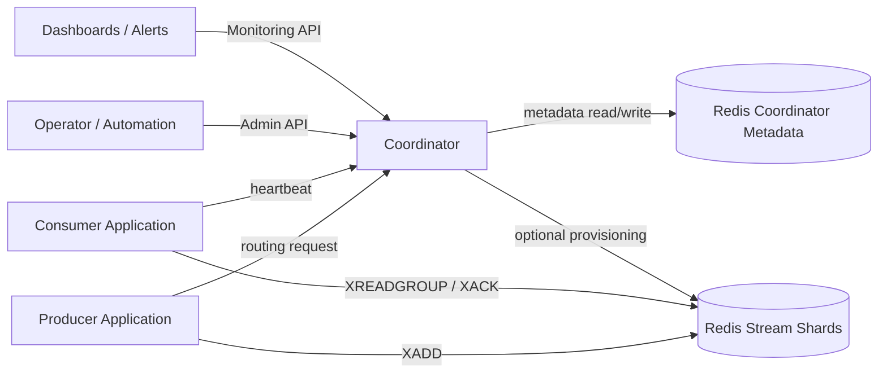
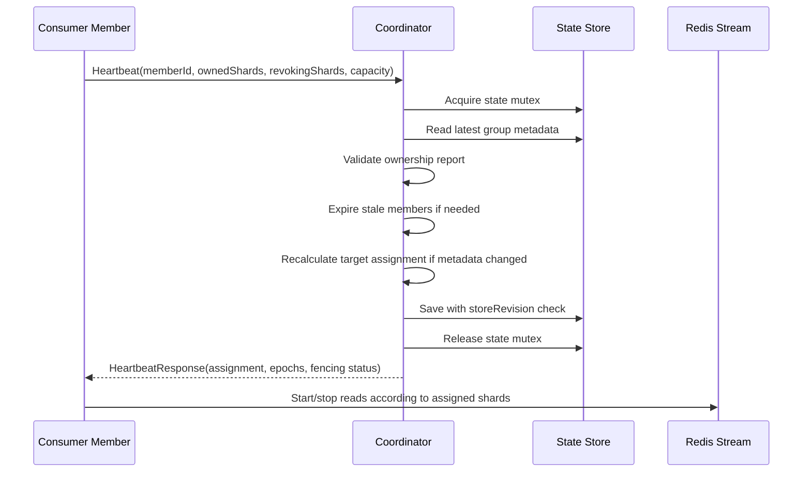

# Coordinator Architecture

## Overview

Redis Stream Coordinator separates the control plane from the data plane. The coordinator decides which member should own each Redis Stream shard. Consumer applications still perform message reads, business handling, retry, DLQ, and acknowledgement.

## Responsibilities

### Coordinator Server

* Own group metadata and stream version metadata.
* Track member liveness from heartbeats.
* Fence stale or expired owners.
* Calculate sticky target assignment.
* Validate member-reported current assignment.
* Enforce revoke-before-assign.
* Start, monitor, and roll back shard count migrations.
* Serve producer routing metadata.
* Expose monitoring APIs and Micrometer metrics.
* Serialize state changes through Redis state mutex and store revision checks.

### Consumer Module

* Generate or load a member identity.
* Send heartbeat requests.
* Apply assigned shard changes.
* Stop reads for revoked shards.
* Report owned shards, revoking shards, capacity, and progress.
* Handle fencing responses by stopping local work and rejoining.
* Optionally run a Redis Stream polling adapter.

### Producer Module

* Fetch routing metadata from the coordinator.
* Cache routing metadata until `metadataVersion` changes or a stale publish result is observed.
* Route a partition key to a shard.
* Publish records to Redis Stream with configured max length and approximate trim policy.
* Refresh routing metadata when needed.

### Redis Metadata Store

* Store group metadata, stream versions, assignments, member state, audit events, and derived projections.
* Use Cluster-safe hash-tagged keys.
* Use Lua scripts and store revision checks for atomic aggregate/projection updates.
* Use a Redis mutex to serialize coordinator critical sections in open source deployments.

## Control-Plane Flow

## Event Loop

The coordinator event loop runs periodically and performs operational reconciliation:

* expire members whose heartbeat lease has timed out,
* continue rebalance when revocations finish,
* evaluate resharding drain progress,
* update monitoring projections,
* record invariant violations.

The event loop also uses the Redis state mutex. If another coordinator instance already owns the mutex, a tick can be skipped safely because the next tick or another instance can continue reconciliation.

## State Mutex

The Redis-backed state mutex is intended to make open source deployments easier to operate. Users should not need to perfectly enforce `replicas=1`, Kubernetes `Recreate`, or blue/green active-passive behavior before trying the project.

State-changing requests follow this order:

1. acquire mutex,
2. read the latest Redis state,
3. validate and process the request,
4. save with store revision compare-and-set,
5. release mutex.

The mutex provides request-level serialization. Store revision checks remain as a final stale-write guard.

## Rebalance Model

Rebalance is target-assignment driven:

1. Coordinator computes the desired owner for each shard.
2. Members receive target assignment through heartbeat responses.
3. Members stop work for shards that are no longer assigned.
4. Members report revoke acknowledgement.
5. Coordinator makes the shard assignable to the next target member.
6. The next member starts work and reports ownership.

This avoids a global stop-the-world barrier and keeps unaffected members consuming.

## Failure Handling

| Failure | Coordinator Behavior | Member Behavior |
| --- | --- | --- |
| Member heartbeat timeout | Mark member `EXPIRED`, fence its ownership, recalculate assignment | Rejoin with full heartbeat if it comes back |
| Stale ownership report | Reject or fence the member depending on severity | Stop reads and rejoin |
| Coordinator restart | Reload state from Redis and continue from persisted epochs | Continue heartbeating |
| Redis metadata outage | Fail control-plane writes and report degraded health | Keep local policy or stop based on application risk policy |
| Resharding provisioning failure | Keep migration in failed/preparing state and expose it through monitoring | Continue reading existing readable versions |

## Consistency Boundaries

* Coordinator metadata updates are serialized by mutex and protected by store revision checks.
* Redis Stream data-plane messages are not part of the coordinator metadata transaction.
* Producer publish and consumer business processing remain at-least-once.
* Monitoring projections are derived from persisted coordinator state and can be rebuilt.

## Deployment Shape

The recommended deployment is:

* one coordinator service behind a stable HTTP endpoint,
* Redis metadata store reachable from coordinator instances,
* optional multiple coordinator replicas with Redis state mutex enabled,
* consumer and producer applications using the Spring Boot starter,
* external dashboards consuming actuator metrics and monitoring APIs.
