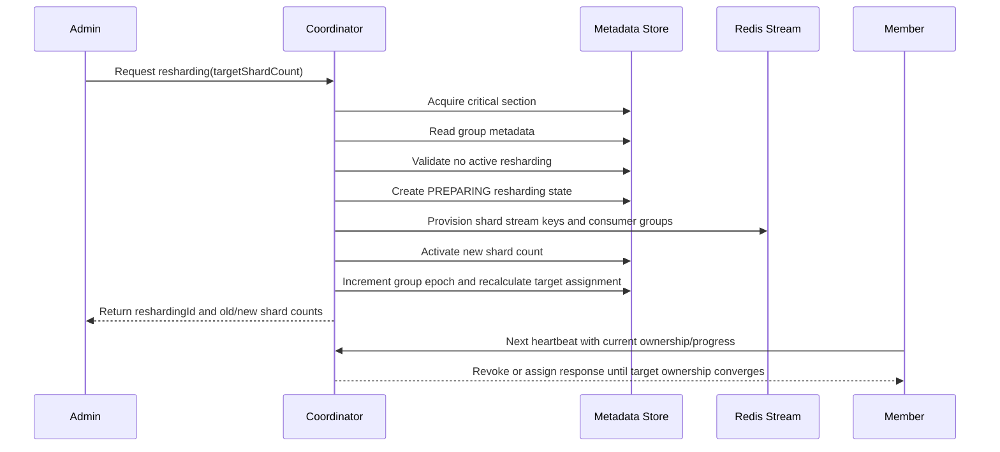

# Resharding, Routing, and Admin API

## Stream Key Model

The coordinator does not append or manage stream-name version tokens. `streamPrefix` is a user-defined Redis Stream namespace. If an application wants versioned names, it must include that version in `streamPrefix` itself, for example `orders-blue` or `orders.2026`.

The coordinator only appends a shard index:

```text
streamKey = "{streamPrefix}:{shardIndex}"
```

Examples:

| User `streamPrefix` | Shard count | Coordinator-created stream keys |
| --- | --- | --- |
| `orders` | `3` | `orders:0`, `orders:1`, `orders:2` |
| `orders-blue` | `2` | `orders-blue:0`, `orders-blue:1` |

`streamPrefix` must not contain Redis Cluster hash tag braces. Shard keys intentionally avoid hash tags so Redis Cluster can distribute them across hash slots.

## Producer Routing

Producers never use a local shard count as the source of truth. They fetch routing metadata from the coordinator:

```json
{
  "streamPrefix": "orders",
  "consumerGroup": "orders-consumer",
  "metadataVersion": 12,
  "shardCount": 8,
  "streamKeyPattern": "orders:{shardIndex}"
}
```

The producer caches this metadata and routes a partition key to a shard index in `[0, shardCount)`. If `metadataVersion` changes, a cache TTL expires, or a publish detects stale routing, the producer refreshes the cache.

Routing is deterministic only within the same routing metadata snapshot:

* same routing protocol,
* same `shardCount`,
* same partition key.

If shard count changes, the same partition key can route to a different Redis Stream shard. The coordinator does not globally deduplicate the same event id across every shard.

## Duplicate Publish Boundary

Important scenario:

1. Producer A publishes `eventId=E`, `partitionKey=order-123` with old routing metadata to shard `2`.
2. The Redis response is lost before the producer observes success.
3. An operator scales the group from `4` shards to `8` shards.
4. Producer A retries after refreshing routing metadata.
5. The same partition key can now route to shard `6`.
6. The same event ID can now exist in two shard locations.

Operational constraint:

* Duplicate-sensitive workloads must not produce during shard scale-out/in.
* Stop producers before scale.
* Drain in-flight XADD and retry windows.
* Execute scale.
* Refresh producer routing metadata.
* Resume publishing.

If producer traffic cannot stop, the workload must be treated as at-least-once and protected by application idempotency.

## Resharding Flow

Shard count changes are performed through the Coordinator Admin API.



## Member Startup Boundary

Member startup is limited to:

* read coordinator metadata through heartbeat,
* create or load a member ID,
* start heartbeating to `{streamPrefix, consumerGroup}`,
* apply assignments received from heartbeat responses,
* report capacity and progress.

Member startup does not:

* submit local YAML shard count as desired state,
* create or mutate group metadata,
* change server-side consumer concurrency policy.

## Admin API Source of Truth

Initial group creation and shard scale-out/in happen only through the Coordinator Admin API.

Source of truth:

* shard count: coordinator group metadata,
* consumer `maxConcurrency`: coordinator consumer concurrency policy,
* routing metadata: coordinator producer routing endpoint.

## Create Group

`initialShardCount` and `consumerConcurrencyPolicy.defaultMaxConcurrency` can be omitted. In that case the coordinator uses configured defaults.

Processing order:

1. Verify the group does not already exist.
2. Validate the requested shard count.
3. Provision shard stream keys and Redis consumer groups when provisioning is enabled.
4. Store consumer concurrency policy.
5. Store `shardCount` and `groupEpoch=1`.
6. Reject duplicate create requests with `409 Conflict`.

## Scale Out / Scale In

`scale-out` and `scale-in` are represented by the same `targetShardCount` request.

The coordinator accepts the request only when:

* there is no active resharding for the group,
* `targetShardCount` differs from the current shard count,
* `targetShardCount` is positive.

If a consumer concurrency policy is provided with the scale request, it is stored in the same metadata update.

## Consumer Concurrency Update

When only the local worker capacity limit changes, operators use the consumer concurrency API. This does not change shard count.

Rules:

* the policy is propagated through `assignedMaxConcurrency` in heartbeat responses,
* a member cannot exceed server-side policy even if it reports a larger runtime capacity,
* reducing concurrency does not reduce shard count,
* if the assignment weight policy depends on `maxConcurrency`, the coordinator increments `groupEpoch` and recalculates assignment,
* no-op updates return current policy without writing new metadata.

## Monitoring

Group monitoring returns:

* group epoch,
* assignment epoch,
* shard count,
* consumer concurrency policy,
* active resharding,
* target/current assignment summary,
* member liveness,
* revoke progress,
* consumer progress.

Resharding monitoring returns:

* `reshardingId`,
* old/new shard counts,
* provisioning state,
* member-reported drain progress,
* revoke progress,
* rollback eligibility.

## Rollback

Rollback is allowed only while the resharding state can be safely reversed by metadata. If messages were already written to newly added shard indexes, they must be drained, replayed, or handled by an operator-defined policy. Rollback does not provide a global transaction across Redis Stream data and coordinator metadata.
