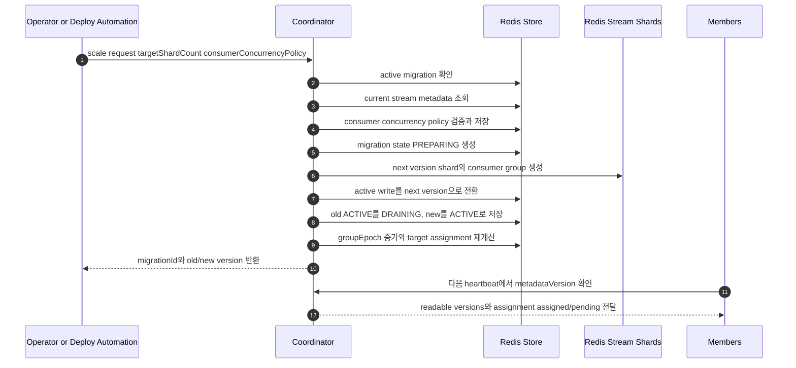

# Stream Version Migration and Routing

## Routing Contract

이 문서에서 topic partition에 해당하는 최소 routing 단위는 Redis Stream shard이다.

`streamVersion`, `activeWriteVersion`, `readableVersions`, `fromVersion`, `toVersion`은 모두 정수이다. `v1`, `v2` 같은 prefix 문자열을 저장하지 않는다.

Producer는 local shard count를 직접 쓰지 않는다.

```text
metadata = metadataCache.activeWrite(streamPrefix)
shardIndex = hash(metadata.hashAlgorithm, metadata.hashSeed, partitionKey) % metadata.shardCount
streamKey = format(metadata.streamKeyFormat, streamPrefix, metadata.streamVersion, shardIndex)
```

## Coordinator Admin Scale Request

Shard count 변경은 member startup이나 `application.yaml` desired spec sync로 시작하지 않는다. 운영자 또는 배포 자동화가 Coordinator Admin API에 scale-out/in을 요청하고, coordinator가 metadata를 검증한 뒤 migration을 시작한다. producer, consumer, direct Redis key write는 shard count를 변경할 수 없다.



Member startup에서 수행하는 일은 다음으로 제한한다.

* coordinator metadata를 읽어 active write version과 readable versions를 캐시한다.
* 직접 생성한 `memberId`로 heartbeat를 시작한다.
* heartbeat는 coordinator API의 `{streamPrefix, consumerGroup}` path로 보낸다.
* heartbeat response로 받은 assignment만 current assignment에 반영한다.
* local YAML의 shard count를 coordinator에 desired state로 제출하지 않는다.
* local YAML의 group identifier 값으로 group을 생성하거나 변경하지 않는다.
* local YAML의 `maxConcurrency`는 runtime upper bound일 뿐, coordinator의 server-side consumer concurrency policy를 변경하지 않는다.

## Admin API Semantics

초기 group 생성과 shard scale-out/in은 Coordinator Admin API로만 수행한다.

Source of truth:

* shard count는 coordinator stream metadata가 유일한 source of truth이다.
* consumer `maxConcurrency`는 coordinator consumer concurrency policy가 유일한 server-side source of truth이다.
* `maxConcurrency`는 partition/shard 개수가 아니라 member 내부 consumer worker 수이다.
* member heartbeat는 현재 runtime 여유 consumer worker 수를 보고할 수 있지만, shard count나 server-side `maxConcurrency`를 변경하지 못한다.

### Create Group

```http
POST /coord/v1/streams/{streamPrefix}/groups/{consumerGroup}
```

```json
{
  "initialShardCount": 12,
  "hashAlgorithm": "murmur3",
  "hashSeed": "default",
  "versionPolicy": "AUTO_INCREMENT",
  "consumerConcurrencyPolicy": {
    "defaultMaxConcurrency": 12
  },
  "reason": "create summary group",
  "requestedBy": "deploy-automation"
}
```

`initialShardCount`와 `consumerConcurrencyPolicy.defaultMaxConcurrency`가 생략되면 coordinator YAML의 `defaults` 값을 사용한다. 요청에 값이 있으면 해당 group metadata에 개별 설정으로 저장한다.

처리 순서:

1. group metadata가 없으면 stream version `1`을 생성한다.
2. `1` shard stream과 Redis consumer group을 생성한다.
3. server-side consumer concurrency policy를 저장한다.
4. `activeWriteVersion=1`, `readableVersions=[1]`, `groupEpoch=1`을 저장한다.
5. group metadata가 이미 있으면 `409 Conflict`로 거절한다.

### Scale Group

`scale-out`과 `scale-in`은 같은 API의 `targetShardCount` 차이로 표현한다.

```http
POST /coord/v1/streams/{streamPrefix}/groups/{consumerGroup}/scale
```

```json
{
  "targetShardCount": 24,
  "consumerConcurrencyPolicy": {
    "defaultMaxConcurrency": 24
  },
  "reason": "increase consumer parallelism",
  "requestedBy": "deploy-automation",
  "deprecatedAfter": "P7D"
}
```

Coordinator는 다음 조건을 만족할 때만 요청을 수락한다.

* 같은 group에 active migration이 없다.
* `targetShardCount`가 현재 active shard count와 다르다.
* `targetShardCount`가 양수이다.
* 현재 active stream metadata의 hash algorithm과 hash seed가 요청 정책과 호환된다.

`consumerConcurrencyPolicy`를 함께 보낸 scale 요청은 migration metadata와 consumer concurrency policy를 하나의 coordinator metadata update로 반영한다.
같은 group에 active migration이 있거나 이미 같은 shard count이면 새 migration을 만들지 않고 conflict 또는 no-op response로 처리한다.

Response:

```json
{
  "migrationId": "mig-018f8d27",
  "fromVersion": 1,
  "toVersion": 2,
  "fromShardCount": 12,
  "toShardCount": 24,
  "state": "PREPARING"
}
```

### Update Consumer Concurrency

Shard count 변경 없이 member 내부 consumer worker 수 상한만 바꿀 때는 consumer concurrency API를 사용한다. 이 API는 새 stream version을 만들지 않고 `metadataVersion`을 증가시킨 뒤 member heartbeat response의 `assignedMaxConcurrency`를 갱신한다. assignment weight policy가 `maxConcurrency`를 사용하는 경우에만 `groupEpoch`도 증가시키고 target assignment를 다시 계산한다.

```http
PATCH /coord/v1/streams/{streamPrefix}/groups/{consumerGroup}/consumer-concurrency
```

```json
{
  "defaultMaxConcurrency": 24,
  "memberOverrides": [
    {"memberName": "summary-consumer-a", "maxConcurrency": 16}
  ],
  "reason": "raise server-side consumer concurrency",
  "requestedBy": "deploy-automation"
}
```

처리 규칙:

* 변경된 consumer concurrency policy는 member heartbeat response의 `assignedMaxConcurrency`로 전파된다.
* member가 heartbeat에서 더 큰 runtime consumer worker 수를 보고해도 server-side policy를 초과해서 worker를 열 수 없다.
* concurrency 축소는 partition/shard 수를 줄이지 않는다. member는 소유 shard를 더 적은 consumer worker로 multiplexing한다.
* coordinator는 Kafka-style rebalance control plane이므로 별도 global min/max concurrency config를 두지 않는다.
* 요청값이 현재 policy와 같으면 metadata를 새로 쓰지 않고 현재 policy를 반환한다.

### Get Metadata

```http
GET /coord/v1/streams/{streamPrefix}/groups/{consumerGroup}
```

반환 값에는 `groupEpoch`, `assignmentEpoch`, `activeWriteVersion`, `readableVersions`, consumer concurrency policy, active migration, target/current assignment summary가 포함된다.

### Get Migration

```http
GET /coord/v1/streams/{streamPrefix}/groups/{consumerGroup}/migrations/{migrationId}
```

반환 값에는 old/new version, member-reported drain progress, revoke progress가 포함된다.

### Rollback Migration

```http
POST /coord/v1/streams/{streamPrefix}/groups/{consumerGroup}/migrations/{migrationId}/rollback
```

Rollback은 cutover 직후 rollback window 안에서만 허용한다. 이미 new version에 write된 message는 운영 정책에 따라 drain 또는 replay 대상이 된다.

### Authorization and Audit

* create, scale, consumer concurrency update, rollback은 운영 권한이 있는 caller만 호출할 수 있다.
* MVP 접근제어는 coordinator YAML의 `admin-username` / `admin-password` 기반 Basic Auth로 처리한다.
* 모든 admin mutation은 `requestedBy`, `reason`, `requestedAt`, `coordinatorId`를 audit log로 남긴다.

## Online Migration

```text
old ACTIVE    accepts_writes=true  accepts_reads=true
new PREPARING accepts_writes=false accepts_reads=false

cutover 후

old DRAINING  accepts_writes=false accepts_reads=true
new ACTIVE    accepts_writes=true  accepts_reads=true
```

Coordinator 책임:

* next stream version metadata 생성
* stream shard와 consumer group 생성
* active write pointer 전환
* readable versions 갱신
* group epoch 증가
* target assignment 재계산
* old version drain 완료 후 `DEPRECATED` 전환

Member 책임:

* readable versions에 포함된 shard만 처리한다.
* assigned `ACTIVE`와 `DRAINING` shard를 모두 읽는다.
* `DRAINING` shard drain 완료 여부를 heartbeat `ownedShards`와 `revokingShards`로 보고한다.

## Migration Completion

old version을 `DEPRECATED`로 바꾸려면 다음 조건을 만족해야 한다.

* old version의 target assignment가 비어 있다.
* 모든 live member `ownedShards`에서 old version shard가 제거됐다.
* old version을 처리하던 member가 drain complete를 보고했다.

## Rollback Policy

Cutover 직후 문제가 있으면 coordinator는 active write pointer를 old version으로 되돌릴 수 있다. 단, rollback window 안에서만 허용하고 new version에 이미 write된 message는 운영 정책에 따라 drain 또는 replay한다.
