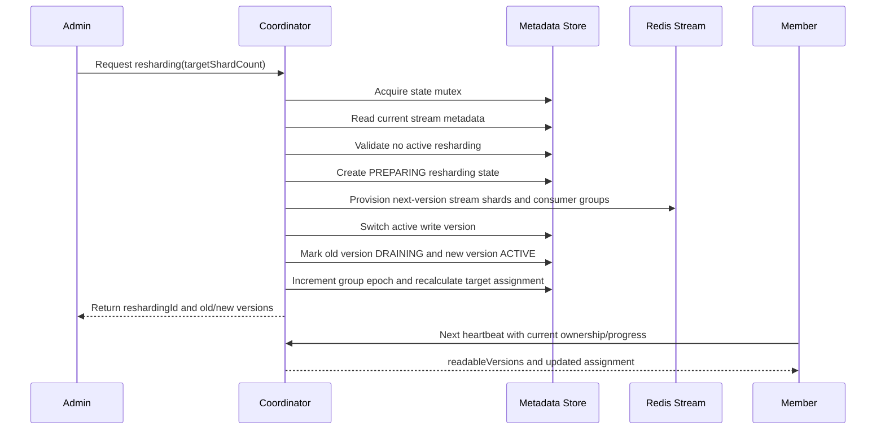

# Stream Version Migration and Routing

## Stream Version Model

The minimum routing unit is a Redis Stream shard. Each stream version has a fixed shard count.

Version fields are integers:

* `streamVersion`
* `activeWriteVersion`
* `readableVersions`
* `fromVersion`
* `toVersion`

The coordinator does not store version strings such as `v1` or `v2`.

## Producer Routing

Producers never use a local shard count as the source of truth. They fetch routing metadata from the coordinator:

```json
{
  "streamPrefix": "orders",
  "consumerGroup": "orders-consumer",
  "metadataVersion": 12,
  "activeWriteVersion": 2,
  "shardCount": 8,
  "streamKeyPattern": "orders.v{version}.s{shard}"
}
```

The producer caches this metadata and routes a partition key to a shard within the active write version. If `metadataVersion` changes, or a publish detects stale routing, the producer refreshes the cache.

## Routing Boundary

Routing is deterministic only within the same routing metadata snapshot:

* same routing protocol,
* same `activeWriteVersion`,
* same `shardCount`,
* same partition key.

If shard count or active stream version changes, the same partition key can route to a different Redis Stream shard.

Example:

1. `order-123` routes to version `1`, shard `2` when shard count is `4`.
2. The group scales to version `2`, shard count `8`.
3. `order-123` can now route to version `2`, shard `6`.

## Duplicate Publish Boundary

The project supports shard-local idempotent publish behavior where Redis and application configuration allow it, but it does not globally deduplicate the same `eventId` across all versions and shards.

Important scenario:

1. Producer A publishes `eventId=E`, `partitionKey=order-123` with old routing metadata to version `1`, shard `2`.
2. The Redis response is lost before the producer observes success.
3. An operator performs shard scale-out and the active write version becomes `2`.
4. Producer A retries after refreshing routing metadata.
5. The same partition key routes to version `2`, shard `6`.
6. The same event ID can now exist in two different stream version/shard locations.

Operational constraint:

* Duplicate-sensitive workloads must not produce during shard scale-out/in.
* Stop producers before scale.
* Drain in-flight XADD and retry windows.
* Execute scale.
* Refresh producer routing metadata.
* Resume publishing.

If producer traffic cannot stop, the workload must be treated as at-least-once and protected by application idempotency.

## Resharding Flow

Shard count changes are performed through the Coordinator Admin API.



## Member Startup Boundary

Member startup is limited to:

* read coordinator metadata,
* create or load a member ID,
* start heartbeating to `{streamPrefix, consumerGroup}`,
* apply assignment received from heartbeat responses,
* report capacity and progress.

Member startup does not:

* submit local YAML shard count as desired state,
* create or mutate group metadata,
* change server-side consumer concurrency policy,
* change active write version.

## Admin API Source of Truth

Initial group creation and shard scale-out/in happen only through the Coordinator Admin API.

Source of truth:

* shard count: coordinator stream metadata,
* consumer `maxConcurrency`: coordinator consumer concurrency policy,
* routing metadata: coordinator producer routing endpoint.

## Create Group

`initialShardCount` and `consumerConcurrencyPolicy.defaultMaxConcurrency` can be omitted. In that case the coordinator uses configured defaults.

Processing order:

1. Verify the group does not already exist.
2. Create stream version `1`.
3. Provision shard stream keys and Redis consumer groups when provisioning is enabled.
4. Store consumer concurrency policy.
5. Store `activeWriteVersion=1`, `readableVersions=[1]`, and `groupEpoch=1`.
6. Reject duplicate create requests with `409 Conflict`.

## Scale Out / Scale In

`scale-out` and `scale-in` are represented by the same `targetShardCount` request.

The coordinator accepts the request only when:

* there is no active resharding for the group,
* `targetShardCount` differs from the current active shard count,
* `targetShardCount` is positive.

If a consumer concurrency policy is provided with the scale request, it is stored in the same metadata update.

## Consumer Concurrency Update

When only the local worker capacity limit changes, operators use the consumer concurrency API. This does not create a new stream version.

Rules:

* the policy is propagated through `assignedMaxConcurrency` in heartbeat responses,
* a member cannot exceed server-side policy even if it reports a larger runtime capacity,
* reducing concurrency does not reduce shard count,
* if the assignment weight policy depends on `maxConcurrency`, the coordinator increments `groupEpoch` and recalculates assignment,
* no-op updates return current policy without writing new metadata.

## Monitoring

Group monitoring returns:

* group epoch,
* assignment epoch,
* active write version,
* readable versions,
* consumer concurrency policy,
* active resharding,
* target/current assignment summary,
* member liveness,
* revoke progress,
* consumer progress.

Resharding monitoring returns:

* `reshardingId`,
* old/new versions,
* provisioning state,
* member-reported drain progress,
* revoke progress,
* rollback eligibility.

## Rollback

Rollback is allowed only shortly after cutover and within the configured rollback window.

If messages were already written to the new version, they must be drained, replayed, or handled by an operator-defined policy. Rollback does not provide a global transaction across Redis Stream data and coordinator metadata.

## Deprecating Old Versions

The old version can move from `DRAINING` to `DEPRECATED` only when:

* the old version has no target assignment,
* no live member reports old-version shards as owned,
* members that processed old-version shards have reported drain completion.
