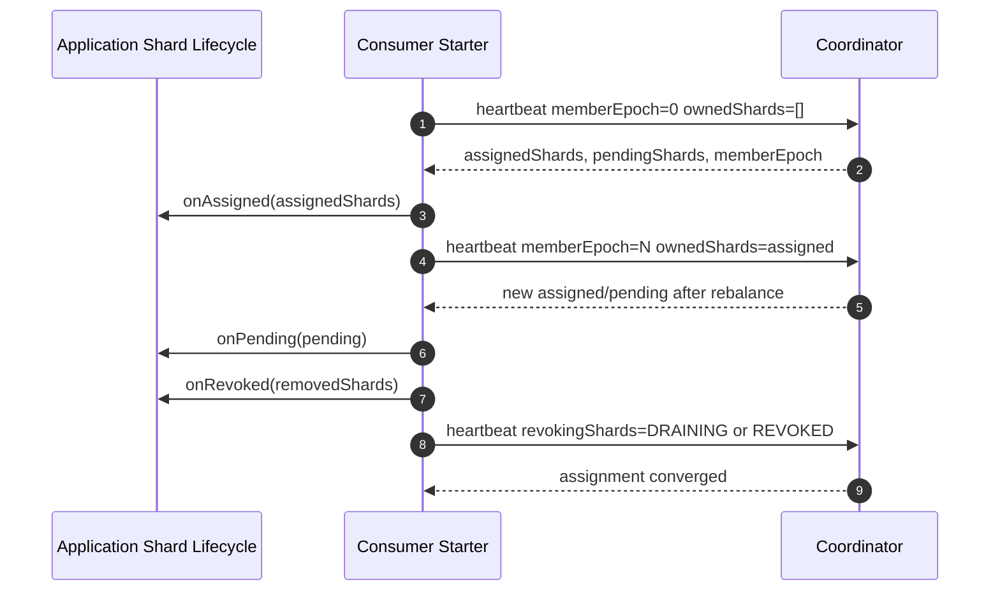

# RedisStream Spring Boot Starter and Integration Contract

## Goal

The coordinator server is only the control plane. Applications still need a runtime integration layer that joins a coordinator group, sends heartbeats, receives shard assignments, starts or stops local shard workers, and reports revoke/drain progress.

This project provides that integration as a Spring Boot starter:

```text
com.redisstream:redisstream-spring-boot-starter
```

Public Kotlin APIs live under `com.redisstream.consumer` and `com.redisstream.producer`.

The starter must be usable by any application without forcing a specific Redis Stream processing framework. Applications can either implement shard lifecycle callbacks directly, or opt into the built-in Redis Stream polling adapter. Application code still owns business handler execution, retries, DLQ, idempotency, and transaction boundaries.

## Public Contract

Application code implements one interface:

```kotlin
interface CoordinatorShardLifecycle {
    fun onAssigned(shards: Set<CoordinatorShard>, context: CoordinatorConsumerContext)

    fun onRevoked(shards: Set<CoordinatorShard>, context: CoordinatorConsumerContext): Set<CoordinatorShard>

    fun onPending(shards: Set<CoordinatorShard>, context: CoordinatorConsumerContext) {
    }

    fun onFenced(context: CoordinatorConsumerContext) {
    }
}
```

Rules:

* `onAssigned` starts or resumes local workers for assigned shards.
* `onPending` exposes shards that are targeted for this member but blocked by revoke-before-assign.
* `onRevoked` stops new reads for revoked shards, drains local in-flight work, and returns the shards that are fully revoked.
* If `onRevoked` returns only part of the requested set, the starter keeps reporting the remaining shards as `DRAINING` and calls `onRevoked` again on later heartbeat cycles.
* `onFenced` stops all local workers and allows the starter to rejoin with `memberEpoch=0`.
* When `graceful-leave-on-stop=true`, the managed consumer sends a final `memberEpoch=-1` heartbeat during shutdown and reports revoked or draining shards.

## Starter Responsibilities

The starter owns:

* stable `memberId` and `memberName` configuration
* heartbeat scheduling
* coordinator HTTP calls
* `memberEpoch` and `metadataVersion` tracking
* `ownedShards` reporting
* `revokingShards` reporting
* assignment diffing
* listener callbacks for assign, pending, revoke, and fenced states

In direct lifecycle mode, the starter does not own:

* Redis Stream polling
* payload deserialization
* user handler execution
* `XACK`
* retry and DLQ
* idempotency markers
* business transaction boundaries

In built-in Redis polling mode, the starter owns:

* shard-key derivation from coordinator assignments
* `XREADGROUP`
* handler invocation through `RedisStreamMessageHandler`
* successful-message `XACK`
* stopping shard pollers during revoke/fencing

The built-in polling mode still does not own retries, DLQ, idempotency markers, or business transaction boundaries.

## Spring Boot Configuration

```yaml
redis-stream-coordinator:
  consumer:
    enabled: true
    coordinator-base-url: http://localhost:8080
    stream-prefix: orders
    consumer-group: orders-consumer
    member-id: ${HOSTNAME:${random.uuid}}
    member-name: orders-worker
    runtime-max-concurrency: 4
    heartbeat-interval: 3s
    rebalance-timeout: 60s
    graceful-leave-on-stop: true
    username: member
    password: member-password
```

If a `CoordinatorShardLifecycle` bean exists, auto-configuration creates a `CoordinatorManagedConsumer` bean. Applications can override `CoordinatorClient` or `CoordinatorManagedConsumer` with their own beans.

Alternatively, applications can enable the built-in Redis Stream consumer adapter by providing a `RedisStreamMessageHandler` bean and enabling `redis-stream-coordinator.consumer.redis.enabled`.

```yaml
redis-stream-coordinator:
  consumer:
    enabled: true
    coordinator-base-url: http://localhost:8080
    stream-prefix: orders
    consumer-group: orders-consumer
    member-name: orders-worker
    redis:
      enabled: true
      poll-batch-size: 10
      poll-timeout: 1s
```

## Runtime Flow



## Producer Routing Client

The RedisStream starter includes a `CoordinatorClient.producerRouting` method so applications can share the same coordinator HTTP client for producer routing metadata. Producer-side local caches must invalidate when `metadataVersion` changes.

The starter also provides a `ProducerRoutingCache` component under `com.redisstream.producer`. It fetches `/producer-routing`, caches the response for `redis-stream-coordinator.producer.routing-refresh-interval`, and replaces the cached metadata when a refreshed response has a newer `metadataVersion`.

```yaml
redis-stream-coordinator:
  producer:
    enabled: true
    coordinator-base-url: http://localhost:8080
    stream-prefix: orders
    consumer-group: orders-consumer
    routing-refresh-interval: 30s
```

Application producers can call `ProducerRoutingCache.route(partitionKey)` and write to the returned `streamKey`, or inject `RedisStreamPublisher` to route and `XADD` in one call. The built-in hasher currently supports `murmur3`, `murmur3_32`, and `murmur3-32` names.

`RedisStreamPublisher` supports single-message field maps, a convenience payload method that writes the `payload` field, and ordered best-effort batch publishing through `publishAll`.

## MVP Acceptance Criteria

* A Spring Boot application can add the starter and implement `CoordinatorShardLifecycle`.
* The starter sends join heartbeats with `memberEpoch=0`.
* The starter tracks `memberEpoch` and `metadataVersion` from coordinator responses.
* The starter notifies newly assigned shards.
* The starter notifies revoked shards and reports revoke completion to the coordinator.
* The starter retries incomplete revoke callbacks across heartbeat cycles for long drain windows.
* The starter resets local assignment state on fencing and rejoins.
* The starter can send a graceful leave heartbeat on shutdown.
* The starter exposes an overridable `CoordinatorClient`.
* The starter provides a producer routing cache that refreshes and replaces metadata by `metadataVersion`.
* The starter rejects producer routing metadata that belongs to a different stream/group or omits active shard indexes.
* The starter provides a Redis Stream publisher that routes by partition key and appends to the active shard.
* The starter provides convenience payload and ordered batch publish APIs.
* The starter provides an opt-in Redis Stream consumer adapter that polls assigned shards and acknowledges successfully handled records.

## Future Work

* Micrometer metrics for heartbeat latency, assignment lag, pending shards, and revoke duration.
* Backoff and circuit-breaker policy for coordinator unavailability.
