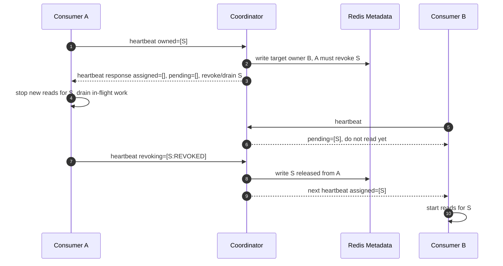

# Failure Handling and Edge Case Design

This document defines how Redis Stream Coordinator handles failure modes rather than only listing individual incidents. The design rule is that every coordinator workflow must be recoverable from the Redis group metadata key and client retries within their leases.

The coordinator does not own Redis Stream message processing. It owns group metadata, member epochs, target assignment, current assignment reports, resharding metadata, and producer routing metadata.

## Design Goals

* Short coordinator outages must not immediately stop healthy consumers or producers.
* Long coordinator outages must fail closed before split ownership or indefinitely stale producer routing can happen.
* A new coordinator pod must continue from Redis-recorded metadata, not from the old pod's memory.
* Heartbeat responses must be repeatable views of the latest Redis-recorded assignment state, not one-shot commands that are lost when a coordinator dies.
* Redis metadata can lose recent writes. If clients report a higher metadata version than Redis currently stores, the coordinator must drive a metadata sync round back to the current Redis version.
* Unsupported Redis commands must fail fast or use a documented fallback.

## Core Model

### Redis-Recorded State Machine

Every coordinator workflow is a Redis-recorded state machine. A response is derived only from the current group metadata key.

```text
request or tick
  -> acquire Redis mutex
  -> load group metadata hash
  -> validate input
  -> compute next state
  -> write metadata with storeRevision CAS
  -> return response derived from the written metadata
```

The response must not ask a client to do something that was not first written to Redis metadata. If the coordinator dies before the write, the client retry sees the old state and retries safely. If the coordinator dies after the write but before the response reaches the client, the next heartbeat or routing refresh returns the same recorded decision while Redis still has that version.

### Metadata Version Correction

A metadata version returned to a client may later disappear from Redis. For example, the coordinator can write metadata version `10`, return it in a heartbeat response, and then Redis can fail over or restore to version `9`. In that case the client has observed a newer state than Redis currently stores.

Redis remains the source of truth. The higher client version is treated as evidence that the client may hold a stale local view, not as authority to rebuild Redis state:

* Coordinator responses include the current `metadataVersion`, `assignmentEpoch`, and relevant member epoch.
* Consumers send their current local `metadataVersion` on every heartbeat.
* If `request.metadataVersion > group.metadataVersion`, the coordinator starts a metadata correction round and responds with `SYNC_METADATA`.
* `SYNC_METADATA` carries the current Redis `metadataVersion`, `assignmentEpoch`, keepable assigned shards, and pending target shards.
* The consumer applies the response as the current metadata truth, keeps only shards it was already reading and that still appear in `assignedShards`, revokes the rest, and retries heartbeat with the corrected version.
* The coordinator sends `SYNC_METADATA` to every known consumer whose heartbeat version does not match the current Redis metadata version while the correction round is active.
* If the consumer is now on the current metadata version but any local or remote revoke is still draining, the coordinator responds with `REVOKE_PENDING`.
* `REVOKE_PENDING` is also idempotent. The consumer keeps draining and does not start newly assigned shards until a later `OK`.
* `OK` is the only status that lets the consumer start newly assigned shards.
* The coordinator does not rebuild Redis metadata from consumer reports and does not auto-increment the rolled-back version just to match a client.

Correction sequence:

```text
higher-version heartbeat
  -> SYNC_METADATA repeated until the member heartbeats with the Redis metadata version
  -> REVOKE_PENDING while local revoke/drain or another member's revoke blocks target shards
  -> OK after all live members are synchronized and conflicting previous owners are released, expired, or fenced
```

### Client Leases

Consumers and producers keep operating only within bounded local leases:

| Client | Lease | While valid | After expiry |
| --- | --- | --- | --- |
| Consumer | Assignment lease from successful heartbeat | Continue current assigned shards and retry heartbeat | Stop reads, stop claiming ownership, rejoin when coordinator returns |
| Producer | Routing cache lease from producer routing metadata | Publish using cached route | Fail publish until routing refresh succeeds |

The consumer assignment lease must be shorter than or equal to the coordinator member lease TTL. This prevents a consumer from reading after the coordinator has expired it and reassigned its shards.

### Idempotent Retry

All coordinator interactions must tolerate retries:

* Heartbeat is idempotent for the same `memberId`, `memberEpoch`, `assignmentEpoch`, owned shards, and revoking shards.
* Revoke acknowledgements are idempotent. Duplicate `REVOKED` reports for a released shard are ignored.
* Producer routing refresh is idempotent by `metadataVersion`.
* Admin mutations use store revision checks and must not silently overwrite newer metadata.

## Generic Failure Checkpoints

Every workflow should be analyzed at these checkpoints.

| Checkpoint | Example | Required behavior |
| --- | --- | --- |
| Request never reaches coordinator | Client timeout, network drop | Client retries while local lease/cache is valid |
| Coordinator fails before a specific metadata write boundary | Process crash before `save()` | Redis remains at the previously recorded workflow state. Client retry or later reconciliation continues from that exact state |
| Coordinator writes metadata but response is lost | Crash after `save()` before HTTP response | Next heartbeat/routing refresh returns the recorded decision if Redis still has that version |
| Client receives response but coordinator goes down | Consumer receives DRAIN, then coordinator outage | Client continues local action and retries reporting progress |
| Client reports completion but response is lost | Consumer sends `REVOKED`, coordinator writes metadata, response lost | Next heartbeat confirms the next recorded assignment state |
| New coordinator starts | Rolling update, crash recovery | New coordinator loads Redis metadata and advances only recorded workflows |
| Redis-backed store accepts a write but later loses it | Client received metadata version `10`, Redis later comes back with version `9` | Non-production mode only. Detect regression when possible and fail closed |
| Redis metadata is missing or corrupt | Key deleted, invalid JSON, missing revision | Fail closed. Do not reconstruct source-of-truth from stale clients or projections |

This checkpoint model is the main tool for handling new edge cases. New features must define their Redis-recorded handoff point, client retry behavior, lease expiry behavior, and repair path.

Before-write failure must always name the write boundary. "Before metadata write" is not one state. It means the coordinator failed before recording the next state transition for that workflow.

## Rebalance Drain Failure Scenario

This is the critical rebalance flow:

```text
member A owns shard S
member C joins or capacity changes
coordinator computes target owner B/C for shard S
coordinator asks member A to drain shard S through heartbeat response
member A stops new reads, drains in-flight work, then reports REVOKED
coordinator assigns shard S to the new target only after release is accepted
```

The DRAIN instruction is not an ephemeral message. It is a response derived from Redis-recorded metadata:

* target assignment says shard `S` should no longer belong to member `A`;
* current assignment still records member `A` as the current or revoking owner;
* member `B` or `C` receives shard `S` as pending until release is accepted;
* assignment epoch identifies the decision.

### Sequence



### Coordinator Down After DRAIN Response

If the coordinator goes down after member `A` receives the DRAIN instruction:

| Actor | Required behavior |
| --- | --- |
| Consumer A | Keep shard `S` in local revoking state. Do not resume reads for `S`. Finish in-flight work and keep retrying heartbeat with `revokingShards=[S:DRAINING or REVOKED]` |
| Consumer B | Treat shard `S` as pending only. Do not read until a later heartbeat returns it in `assignedShards` |
| New coordinator | Reload metadata, see target owner and current/revoking owner, and continue revoke-before-assign |
| Metadata store | Keep target/current assignment and assignment epoch in the group metadata key |

Failure subcases:

| Failure point | Expected outcome |
| --- | --- |
| Coordinator dies before writing target assignment | No DRAIN instruction is recorded. A continues with previous assignment until a later heartbeat/tick recomputes |
| Coordinator writes target assignment but DRAIN response is lost | A keeps old local assignment until next heartbeat. Coordinator returns the same DRAIN decision again from Redis metadata |
| A receives DRAIN and coordinator dies | A stops new reads and drains. It reports progress when coordinator returns |
| A reports `REVOKED` but coordinator dies before writing metadata | A retries `REVOKED`. B remains pending |
| A reports `REVOKED`, coordinator commits metadata, response is lost | Next heartbeat confirms the released state. B can be assigned from committed metadata |
| A dies while draining | Coordinator expires A after member lease TTL or rebalance timeout and then allows reassignment. Duplicate processing is possible and remains at-least-once |
| A restarts after DRAIN without local revoking memory | A rejoins with `memberEpoch=0`. Coordinator validates the rejoin against Redis-recorded target/current state and either keeps it fenced or requires full reconciliation |

Recorded state by write boundary:

| Boundary not reached | Redis-recorded group/shard state | New coordinator behavior |
| --- | --- | --- |
| Join/capacity change was not written | New member/capacity does not exist in metadata, group may still be `STABLE` | Wait for the member heartbeat or capacity request to retry |
| Join/capacity change was written, but target assignment was not written | New member/capacity exists, but shard `S` still belongs to A in target/current assignment | Recompute target assignment on the next heartbeat or reconciliation loop |
| Target assignment was written, but DRAIN response was lost | Group is `RECONCILING`; target owner is B; A remains current/revoking owner; B sees `S` as pending | Return the same DRAIN decision to A on heartbeat; keep B pending |
| A's `REVOKED` report was received, but release write was not written | Group is still `RECONCILING`; A is still current/revoking owner; B remains pending | Wait for A to retry `REVOKED`, or expire/fence A after timeout |
| Release write was written, but assignment response was lost | A no longer blocks `S`; B can receive `S` as assigned | Assign `S` to B on the next heartbeat |

Consumer rule: once a shard enters local revoking state, the consumer must not resume reads for that shard just because heartbeat is temporarily failing. Only a later coordinator assignment can make the shard readable again.

Coordinator rule: a shard must not move from pending to assigned for the new owner until one of these is true:

* previous owner reported `REVOKED` with no in-flight work;
* previous owner expired by member lease TTL;
* previous owner exceeded rebalance timeout and was fenced.

## Coordinator Rolling Update and Temporary Coordinator Loss

This section covers `replicas=1` with rolling update temporarily producing:

```text
1 coordinator -> 2 coordinators -> 1 coordinator
```

It also covers temporary coordinator loss:

```text
1 coordinator -> 0 reachable coordinators -> 1 coordinator
```

The coordinator cannot control Kubernetes readiness, service endpoint propagation, or external load balancers. It only owns process-local terminating state and Redis critical sections.

| Edge case | Risk | Required behavior |
| --- | --- | --- |
| Old and new coordinators both receive traffic | Concurrent metadata mutation | Both must use the same Redis mutex and store revision CAS |
| Old process receives shutdown | Request can be interrupted | Enter terminating mode, stop ticks, reject new critical sections, finish only short in-flight critical sections while mutex is owned |
| Traffic reaches terminating process | New work enters draining process | Return retryable error after terminating mode starts |
| Process dies while holding mutex | New coordinator waits | Redis mutex TTL releases ownership eventually |
| Store revision conflict | Another coordinator committed first | Reload and retry or return retryable conflict |
| No coordinator is reachable | Heartbeats and routing refresh fail | Consumers/producers use valid leases/caches, then fail closed |
| Tick is skipped | Expiration or drain advancement is delayed | Next request or tick recomputes from Redis-recorded metadata |

The new coordinator does not resume old stack frames. It resumes from Redis-recorded metadata:

| Workflow | Redis-recorded handoff point | New coordinator continuation |
| --- | --- | --- |
| Heartbeat | member metadata, epochs, current report, target assignment | Return current recorded assignment decision on retry |
| Expiration | last heartbeat timestamp, member state | Recalculate expiration on request or tick |
| Rebalance | target/current assignment, revoking shards, assignment epoch | Continue revoke-before-assign |
| Graceful leave | `LEAVING` state and revoking shards | Wait for revoke ack, timeout, or expiration |
| Resharding | resharding state, stream versions, active write version, drain progress | Continue provisioning, activation, drain, or rollback |
| Producer routing | metadata version, active write version | Return latest recorded routing metadata |

## Consumer Join, Rejoin, Leave, and Expiration

| Edge case | Risk | Coordinator behavior | Consumer behavior |
| --- | --- | --- | --- |
| New consumer joins | Unnecessary full rebalance | Register member, issue epoch, recalculate sticky target assignment only as needed | Apply assigned and pending shards from heartbeat response |
| Existing consumer rejoins with `memberEpoch=0` | Stale ownership report | Treat as rejoin and validate ownership against target/current assignment | Stop shards not returned by coordinator |
| Consumer reports unassigned owned shard | Split ownership | Reject or fence the stale report | Stop reads and rejoin |
| Graceful leave | Shard can be reassigned too early | Mark `LEAVING`, keep shards pending for new owner until release | Stop reads, drain, report `REVOKED` |
| Crash without leave | Shards stay owned until timeout | Expire after member lease TTL and recalculate assignment | Returning process rejoins with `memberEpoch=0` |
| Duplicate member IDs | Two processes claim one identity | Epoch and ownership validation fence one side | Only accepted epoch continues |
| Long revoke drain | Rebalance stalls | Fence or expire after rebalance timeout | Stop reads when fenced; application handles duplicate attempts |

## Producer Routing During Failures

Producer does not heartbeat. It uses routing metadata refresh.

Because producer has no heartbeat channel, shard-count changes and `activeWriteVersion` changes are propagated only through routing metadata refresh. The producer module must therefore refresh routing metadata periodically even if publishes are succeeding. The refresh interval and routing cache TTL define the maximum time a producer can keep using an older shard layout after the coordinator adds shards or activates a new write version.

Refresh rules:

* Refresh periodically before the local routing cache expires.
* Refresh immediately when a publish path detects stale routing or a metadata-version mismatch.
* Replace the cache only when the refreshed `metadataVersion` is newer.
* Keep the current cache when refresh fails and the cache lease is still valid.
* Fail publish when refresh fails after the cache lease has expired.

| Edge case | Risk | Producer behavior |
| --- | --- | --- |
| Coordinator unavailable and routing cache is valid | Publish would stop unnecessarily | Continue publishing with cached routing metadata |
| Coordinator unavailable and routing cache is expired | Stale routing can continue forever | Fail publish with retryable coordinator-unavailable error |
| Coordinator adds shards but producer has not refreshed yet | Producer keeps writing to the old shard layout | Continue with cached route until refresh; refresh interval/cache TTL bounds propagation delay |
| Lower `metadataVersion` response | Redis metadata rollback or stale coordinator response | Treat as metadata sync. Downgrade only when the coordinator explicitly returns current routing metadata |
| Higher `metadataVersion` response | Local route is stale | Replace cache |
| Publish fails after uncertain `XADD` | Duplicate records on retry | Keep default publish attempts conservative; application owns event idempotency |
| Shard scale happens during produce | Same partition key can route differently | Duplicate-sensitive workloads must quiesce producers before scale |

## Redis Metadata Volatility and Corruption

Coordinator metadata is stored in one Redis hash key per group:

```text
redis-stream:coord:{streamPrefix:consumerGroup}:metadata
```

Recommended hash fields:

```text
aggregate      -> GroupMetadata JSON
revision       -> storeRevision
schemaVersion  -> metadata JSON schema version
layoutVersion  -> Redis metadata layout version
updatedAt      -> last successful metadata write time
```

Required behavior:

| Edge case | Risk | Required behavior |
| --- | --- | --- |
| Metadata key is deleted | Source of truth is gone | Fail closed for the group. Do not reconstruct from heartbeat, routing cache, local state, or Redis stream contents |
| Recent metadata write is lost | Redis state moves backward | If a heartbeat reports a higher version, start a metadata correction round and return `SYNC_METADATA` with the current Redis version |
| `aggregate` is invalid | Assignment cannot be computed | Mark group unhealthy and require restore or repair |
| Hash revision differs from aggregate `storeRevision` | CAS mirror is stale or corrupt | Treat as corruption and require repair |
| Unsupported schema version | Coordinator cannot safely interpret metadata | Fail fast and do not overwrite |
| Store revision conflict | Concurrent coordinator update | Reload and retry or return a retryable conflict |

Operational controls:

* Metadata keys must not have TTL.
* Redis should enable snapshots/AOF or managed backups. These reduce recovery loss; they do not remove the recent-write-loss assumption.
* Coordinator ACL users should not have `FLUSHDB`, `FLUSHALL`, or broad key deletion permissions.
* Monitoring must alert when consumers report higher metadata versions than the current Redis metadata.

Indexes are rebuildable only:

```text
redis-stream:coord:groups
```

Additional index behavior:

| Edge case | Risk | Required behavior |
| --- | --- | --- |
| Group index is deleted | `list()` and tick scan miss groups | Rebuild index through an explicit repair path that scans metadata keys in a controlled operation |
| Index points to missing metadata | Phantom group | Skip stale index entry and optionally remove it |

## Unsupported Redis Version or Command Set

| Edge case | Affected module | Required behavior |
| --- | --- | --- |
| Redis does not support `XACKDEL` | Consumer polling adapter | `AUTO` falls back to `XACK`; explicit `XACKDEL` fails fast |
| Redis does not support `XNACK` | Consumer polling adapter | Default `LEAVE_PENDING` is used; explicit `XNACK` fails fast |
| Redis version cannot be detected | Consumer and producer modules | Startup fails when configured features require version detection |
| Cluster redirects expose unreachable addresses | Coordinator, consumer, producer | Use configured node mappings or fail with clear connection error |
| ACL lacks stream commands | Consumer or producer | Fail startup or first command clearly |
| ACL lacks metadata commands | Coordinator | Health degraded and mutations rejected |
| Standalone/cluster mode mismatch | All Redis clients | Fail startup with clear mode mismatch |

## Design Checklist for New Edge Cases

Every new coordinator feature must answer these questions before implementation:

1. What is the Redis-recorded state machine state?
2. Which metadata fields are written before the response?
3. Is the response repeatable if it is lost?
4. What does the client do while coordinator is unavailable?
5. What local lease or cache bounds client behavior?
6. What happens after the lease expires?
7. Which epoch, revision, or version rejects stale reports?
8. Can a new coordinator rebuild state from Redis metadata plus client retries?
9. What happens if the metadata key is missing?
10. What happens if a consumer reports a higher `metadataVersion` than Redis currently stores?
11. Which client request carries the highest version the client has observed?
12. Which metrics and runbook steps reveal this failure?

## Test Matrix

The implementation should include scenario tests at three levels.

| Level | Purpose | Examples |
| --- | --- | --- |
| Unit | Validate one state transition | target assignment calculation, ownership validation, stale epoch rejection |
| Flow | Validate one Redis-recorded workflow | DRAIN delivered then coordinator unavailable, revoke ack lost, member expiration during drain |
| Integration | Validate Redis and module behavior | Metadata key deletion, revision conflict, rolling update handoff, unsupported Redis command |

Priority tests:

* DRAIN response state written to Redis, response lost, next heartbeat returns same DRAIN.
* DRAIN delivered, coordinator unavailable, consumer keeps shard revoking and does not resume reads.
* `REVOKED` ack written to Redis, response lost, new owner receives assignment on next heartbeat.
* Previous owner expires while draining, new owner receives assignment after expiration.
* Metadata key deleted, coordinator fails closed and does not reconstruct from heartbeat.
* Client receives metadata version `N`, Redis falls back to `N-1`, and the next heartbeat receives `SYNC_METADATA` for `N-1`.
* `SYNC_METADATA` response is lost, the next high-version heartbeat receives the same `SYNC_METADATA` again.
* Consumer receives `SYNC_METADATA`, starts draining removed shards, and receives `REVOKE_PENDING` until it reports `REVOKED` and no other owner blocks its target shards.
* During a metadata correction round, multiple consumers report stale revokes concurrently and the coordinator accepts only revokes that match current Redis target/current ownership.
* Producer cache expires during coordinator outage, publish fails closed.
* New coordinator resumes rebalance from Redis-recorded metadata after old coordinator crash.

## Monitoring and Runbook Requirements

Required signals:

* coordinator terminating state,
* Redis mutex latency and revision conflict count,
* heartbeat success/failure by status,
* member heartbeat age,
* metadata version regression count,
* client-reported max metadata version higher than stored coordinator metadata,
* consumer assignment lease remaining time,
* member revoking shard count,
* producer routing cache age and refresh failures,
* metadata revision conflict count,
* metadata schema/layout error count,
* Redis command compatibility failure count.

Runbooks should cover:

* DRAIN issued but revoke ack not progressing,
* coordinator unreachable during heartbeat,
* rolling update handoff stall,
* member lease expiration and rejoin,
* Redis metadata key loss or corruption,
* unsupported Redis command configuration,
* producer routing cache expiry during coordinator outage.
